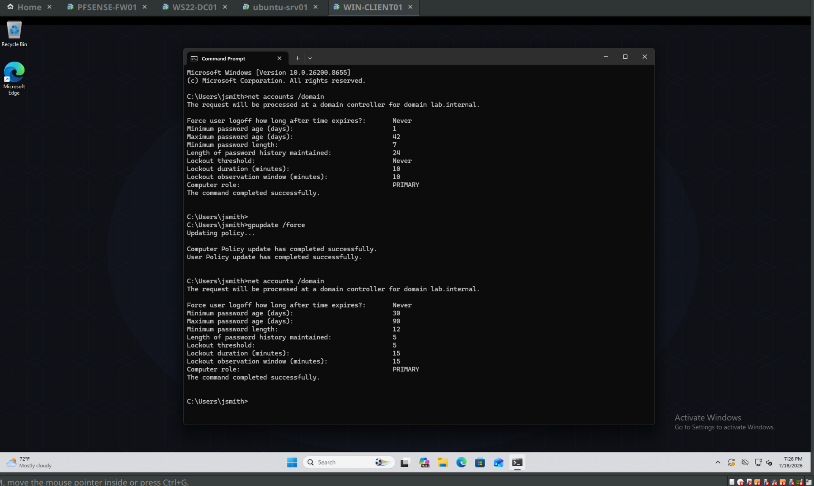

# Home Lab — Enterprise Network in VMs

A self-directed infrastructure lab: an enterprise-style network built from scratch in VMware Workstation Pro on Linux — segmented networking behind a pfSense firewall, a Windows Server 2022 Active Directory domain, a Linux SMTP relay in a screened subnet, departmental file shares, Group Policy, and PowerShell automation. Everything is documented phase by phase, including what broke and how I diagnosed it, because the debugging is where the actual learning happened.

This isn't a series of one-off exercises. It's one persistent environment where every phase builds on the last — the monitoring I set up in Phase 4 emailed me its daily DC health report, unprompted, while I was in the middle of building Phase 5.

## The environment

| Host | OS | Role |
|---|---|---|
| PFSENSE-FW01 | pfSense CE 2.8.1 | Firewall / router between all segments |
| WS22-DC01 | Windows Server 2022 | AD DS, DNS, DHCP, file services |
| ubuntu-srv01 | Ubuntu Server 24.04 | Postfix SMTP relay (DMZ) |
| WIN-CLIENT01 | Windows 11 Pro | Domain-joined client |

Four network segments, each routed and filtered through pfSense: Management (10.0.10.0/24), Servers (10.0.20.0/24), Workstations (10.0.30.0/24), and a screened DMZ (10.0.40.0/24) with default-deny policy back into the internal networks.

## The phases

**[Phase 1 — Foundation](phases/01-foundation.md)** · pfSense + three VMs on a deliberately flat network to validate routing before adding complexity. First real diagnostic win: "Windows machines unpingable" that looked like a network fault but was Windows Firewall's default inbound ICMP block — spotted by the asymmetry (Linux pingable, Windows not), later fixed properly via GPO instead of per-host.

**[Phase 2 — Active Directory](phases/02-active-directory.md)** · Promoted the DC for `lab.internal`: AD DS, AD-integrated DNS with forward/reverse zones, and a live DHCP migration off pfSense (build-then-cutover, so two DHCP servers never answered at once). OU structure, first GPOs, domain-joined client. Includes an appendix demonstrating that AD is LDAP underneath — querying the same directory from the Linux box with `ldapsearch`.

**[Phase 3 — Segmentation](phases/03-vlans-segmentation.md)** · Broke the flat network into the four segments above and wrote the firewall policy between them: workstations can reach servers but not the DMZ or management, the DMZ can't initiate anything inward. Re-IP'd a live domain controller — the part everyone underestimates is the DNS cleanup (re-registering SRV records, purging stale A records) so clients can still find the DC. Verified with a full allow/block test matrix, not just "it works."

**[Phase 4 — SMTP & email](phases/04-smtp-email.md)** · Postfix on the DMZ box as an internal-only relay, locked down with `mynetworks` scoping and `reject_unauth_destination`, STARTTLS verified with `openssl s_client`. The DC emails itself a daily AD health report (NTDS/DNS/Netlogon) via PowerShell + Task Scheduler through the relay. Also caught and fixed a firewall rule-ordering bug from Phase 3 where a broad pass rule sat above two blocks, silently making them dead — first-match-wins in practice. Writeup covers SPF/DKIM/DMARC and why they can't fully apply to a non-public domain.

**[Phase 5 — File shares, GPO & automation](phases/05-fileshares-gpo-automation.md)** · Departmental SMB share secured with AGDLP (global groups nested into domain-local permission groups), NTFS inheritance audited and cleaned — including inherited create-file permissions from `C:\` that would've let any user drop files into a "locked down" share. Access-Based Enumeration, and a deliberate share-vs-NTFS conflict to prove most-restrictive-wins from the client side. Group Policy work includes the classic account-policy gotcha (password policy linked to an OU silently does nothing for domain accounts — proved with before/after `net accounts` output, then fixed at the domain level) and per-group drive mappings via item-level targeting. Finishes with `New-LabUsersFromCsv.ps1`: bulk AD user provisioning that derives OU placement and group membership from a Department column.

## Skills demonstrated

**Windows:** Active Directory (DS/DNS/DHCP), OU and group design, Group Policy (Policies and Preferences, item-level targeting, gpresult/RSoP troubleshooting), NTFS + share permissions, SMB file services, Task Scheduler.
**Networking:** subnetting and segmentation, firewall rule design (stateful, first-match, default-deny), DHCP relay, DNS (zones, SRV records, forwarders), NAT.
**Linux:** Ubuntu Server administration, Postfix, TLS verification, LDAP tooling.
**Automation:** PowerShell (ActiveDirectory module, bulk provisioning from CSV, scheduled health checks), Bash.
**Practice:** snapshot-before-change discipline, staged testing, verification matrices, and documenting failures with root causes instead of pretending everything worked the first time.

## Certifications

CompTIA Network+ (N10-009) — July 2026. AWS Solutions Architect – Associate in progress (expected October 2026).

## What's next

Phase 6: Docker on the DMZ box, starting with a containerized monitoring workload. Then AWS — the cloud phases will be new builds alongside this environment, not a migration of it.

---

*Michael Baldwin · [GitHub](https://github.com/mbaldwin2015) · Full phase writeups linked above.*
