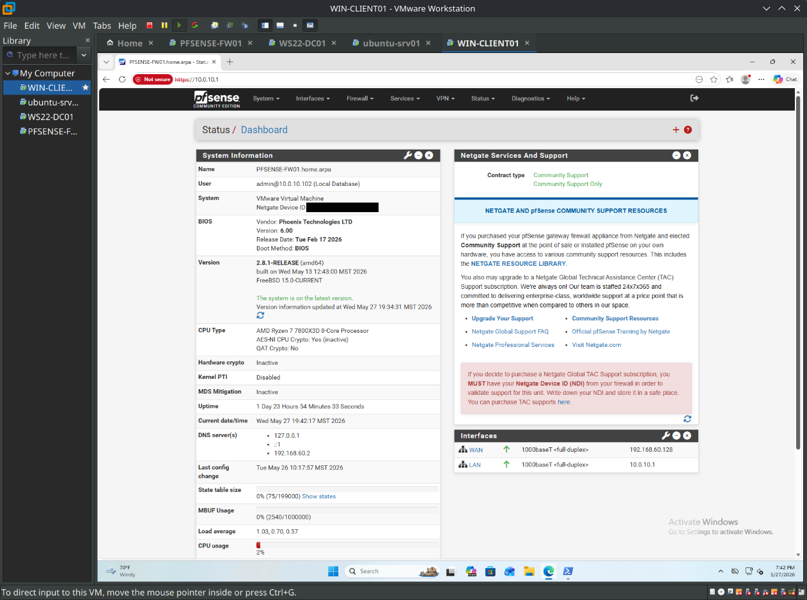
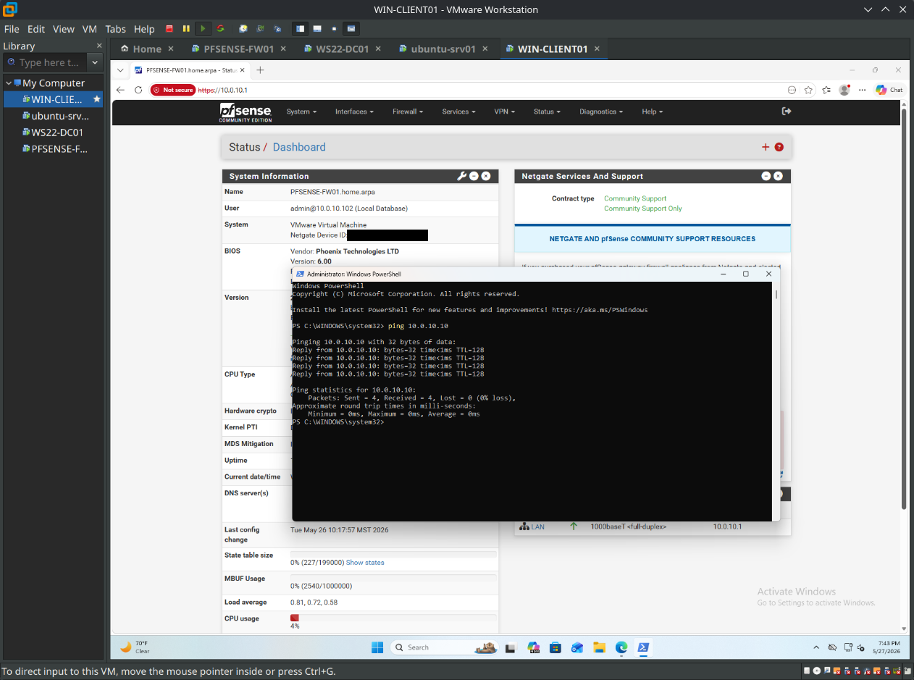
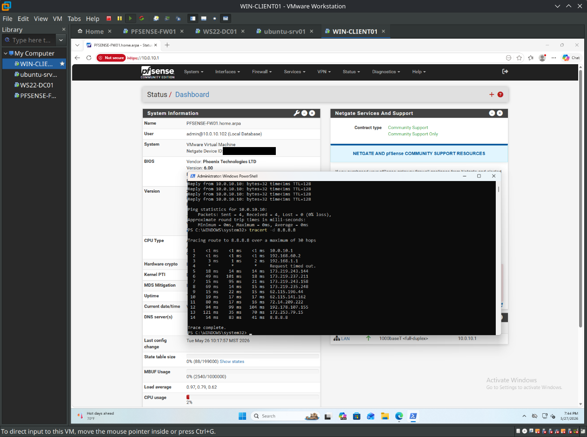

# Phase 1 — Foundation

**Status:** Complete · **Date:** 2026-05-26

Stood up the base virtual environment for the home lab: a pfSense firewall/router plus three VMs (a Windows Server, an Ubuntu server, and a Windows 11 client) on a single flat LAN behind pfSense, with verified internet access and full internal connectivity. This phase establishes the network plumbing every later phase builds on. VLANs, Active Directory, and the rest come later — Phase 1 deliberately keeps everything on one flat subnet to validate basic routing and connectivity before adding complexity.

## Host environment

- **Host OS:** Linux
- **Hypervisor:** VMware Workstation Pro
- **Host resources:** 32 GB RAM, 1.5 TB disk

## Virtual network design

Two VMware virtual networks back the lab:

| VMware network | Type | Role | Notes |
|---|---|---|---|
| `vmnet8` | NAT | **WAN** | Provides internet to pfSense; pfSense's WAN pulls a DHCP lease here |
| `vmnet1` | Host-only | **LAN** | All lab VMs attach here; VMware's own DHCP is **disabled** so pfSense can serve DHCP |

pfSense bridges the two: its WAN NIC sits on `vmnet8` (internet via VMware's NAT) and its LAN NIC on `vmnet1` (the internal network). Every other VM has a single NIC on `vmnet1` and reaches the internet *through* pfSense.

## Virtual machines

| Hostname | OS | Role | vCPU / RAM / Disk | NIC(s) | IP (Phase 1) |
|---|---|---|---|---|---|
| `PFSENSE-FW01` | pfSense CE 2.8.1 | Firewall / router / DHCP | 1 / 2 GB / 16 GB | em0 → vmnet8 (WAN), em1 → vmnet1 (LAN) | WAN: DHCP (192.168.60.x) · LAN: 10.0.10.1/24 |
| `WS22-DC01` | Windows Server 2022 Standard (Desktop Experience) | Future domain controller | 2 / 4 GB / 60 GB | vmnet1 | 10.0.10.10/24 (static) |
| `ubuntu-srv01` | Ubuntu Server 24.04 LTS | Future SMTP / monitoring / syslog | 2 / 2 GB / 25 GB | vmnet1 | 10.0.10.20/24 (static) |
| `WIN-CLIENT01` | Windows 11 Pro | Domain client / admin workstation | 2 / 4 GB / 64 GB | vmnet1 | DHCP (10.0.10.100–199) |

### Addressing note (important)

Phase 1 runs everything on a single flat subnet, **10.0.10.0/24**, with pfSense as the gateway at `10.0.10.1`. These are **temporary** addresses. The target design (see [`../docs/ip-plan.md`](../docs/ip-plan.md)) segments hosts into VLANs (Servers on 10.0.20.0/24, Workstations on 10.0.30.0/24, etc.); those subnets don't exist until VLANs are configured in Phase 3, at which point the servers get re-IP'd and the client re-leases onto its VLAN subnet. Building flat first isolates variables — if something breaks after VLANs are introduced, the flat network is already known-good.

### Design decisions

- **Servers static, clients DHCP.** `WS22-DC01` and `ubuntu-srv01` use static IPs because servers — especially the upcoming domain controller — need stable, predictable addresses. The client rides DHCP from pfSense.
- **pfSense managed from a workstation, not the firewall console.** Ongoing administration happens via the web GUI from a LAN client, modeling real-world practice: you don't administer infrastructure by logging into the box itself.
- **pfSense host domain vs. AD domain are separate.** pfSense's own domain is `home.arpa`; the Active Directory domain (`lab.internal`, created in Phase 2) is a distinct namespace, and pfSense doesn't need to match it.

## pfSense configuration

- **Version:** pfSense CE 2.8.1, installed via the Netgate online installer (which fetches packages over the WAN during installation).
- **Interfaces:** WAN = `em0` (vmnet8, DHCP), LAN = `em1` (vmnet1, `10.0.10.1/24`).
- **DHCP server:** enabled on LAN, pool `10.0.10.100–10.0.10.199` (serves the client until the domain controller takes over DHCP in a later phase).
- **DNS:** resolver in default recursive mode (queries root servers); WAN-provided DNS allowed to override.
- **Timezone:** `America/Phoenix` (Arizona — no DST, MST year-round; accurate time matters for the Kerberos authentication coming with AD).
- **Setup wizard:** completed; default `admin`/`pfsense` password changed; hostname set to `PFSENSE-FW01`.

## Verification

- **Internet egress:** every VM successfully pings `8.8.8.8`, confirming each reaches its gateway (pfSense, `10.0.10.1`) and routes out through VMware NAT.
- **Internal connectivity:** all four VMs ping each other across `10.0.10.0/24`.
- **Path validation:** `tracert` from the client to the internet shows the first hop as pfSense (`10.0.10.1`), confirming traffic correctly routes through the firewall.

### Screenshots


*pfSense Status → Dashboard: version, interfaces, and WAN/LAN addresses.*


*Cross-VM ping confirming internal connectivity on 10.0.10.0/24.*


*`tracert` from WIN-CLIENT01 showing traffic routing through pfSense (10.0.10.1) out to the internet.*

## Problems hit & how I solved them

The failures and fixes were the real learning in this phase.

**1. pfSense now requires internet *during* installation.**
Netgate replaced the old offline ISO with an online "Netgate Installer" that downloads packages mid-install. Installation can't proceed unless the WAN NIC (on vmnet8/NAT) already has a working DHCP lease and internet. Lesson: the WAN has to be live *before* starting the pfSense install now, not just after.

**2. pfSense's WAN sits on a private (RFC1918) network.**
Because the WAN gets its address from VMware's NAT (192.168.60.x), it's on a private range, and pfSense's default "Block private networks on WAN" rule technically blocks that class. Outbound traffic still works fine, though — pfSense is stateful, so it only blocks *unsolicited inbound* from those addresses while allowing replies to connections it initiated. Understanding *why* it still worked (stateful return traffic) was the takeaway, rather than blindly disabling the rule.

**3. Ubuntu's installer "Subnet" field wanted CIDR, not a subnet mask.**
I first entered `255.255.255.0` - nonsense. That field wants the network in CIDR notation (`10.0.10.0/24`); the host's own address goes in a separate field. The "/24" already expresses the mask. Corrected and continued.

**4. (The big one) Windows Firewall blocks inbound ping by default.**
After install, every VM could ping the internet and ping the *Ubuntu* box — but not the *Windows* boxes. This looked like a network fault but wasn't: the network was provably fine (internet worked). Windows Firewall silently drops inbound ICMP echo by default, so the Windows machines were unreachable to ping while still fully functional. Diagnosed by spotting the asymmetry (Ubuntu pingable, Windows not), then enabled the inbound ICMPv4 echo rule on each Windows box:

```powershell
New-NetFirewallRule -DisplayName "Allow ICMPv4-In" -Protocol ICMPv4 -IcmpType 8 -Direction Inbound -Action Allow
```

(Equivalently: `Enable-NetFirewallRule -DisplayName "File and Printer Sharing (Echo Request - ICMPv4-In)"`.) Worth noting that blocking ICMP is the *correct* security default — opening it here is a deliberate lab-visibility tradeoff. In a later phase this gets pushed to all domain machines centrally via Group Policy instead of being set per host.

## What's next (Phase 2 — Active Directory)

- Promote `WS22-DC01` to a domain controller for the `lab.internal` domain (AD DS, DNS, DHCP).
- Repoint client DNS to the DC and move DHCP responsibility to the DC.
- Build an OU structure, users, groups, and the first Group Policy Objects.
- Domain-join `WIN-CLIENT01`.

---

*Part of the [Home Lab: Enterprise Network in VMs](../README.md) project. Last updated: 2026-05-26.*
