# Phase 2 — Active Directory & Core Services

**Status:** Complete
**Date:** 2026-06-03
**Domain:** lab.internal (NetBIOS: LAB)
**Goal:** Promote WS22-DC01 to a domain controller; stand up AD DS, DNS, and DHCP; build an OU structure with test users and groups; deploy the first GPO; domain-join the Windows client and verify end to end.

> **Network note:** Phase 2 was built on the existing flat **10.0.10.0/24** network. VLAN segmentation (servers → 10.0.20.x, workstations → 10.0.30.x, DMZ → 10.0.40.x) is deferred to Phase 3, so all services here live on 10.0.10.0/24.

## As-built summary

| Component | Detail |
|---|---|
| Domain / forest | lab.internal, single-domain forest |
| Functional level | Windows Server 2016 (highest available on Server 2022) |
| Domain controller | WS22-DC01 @ 10.0.10.10 (static) |
| DNS | AD-integrated; forward zones `lab.internal` + `_msdcs.lab.internal`; reverse zone `10.0.10.0/24`; forwarder → 10.0.10.1 (pfSense) |
| DHCP | Migrated from pfSense to WS22-DC01; scope 10.0.10.100–200 |
| OUs | Staff, Workstations, Servers, Groups (domain root) |
| First GPO | "Staff Desktop" — desktop wallpaper, linked to Staff OU |
| Domain client | WIN-CLIENT01 joined to lab.internal |

## 1. Domain controller promotion

Installed the AD DS role on WS22-DC01 and promoted it as the first DC in a new forest, `lab.internal` (NetBIOS `LAB`). DNS Server was installed automatically as part of the forest promotion. No DNS delegation was created (isolated lab — no parent zone). The exact promotion script is in [Appendix A](#appendix-a--dc-promotion-powershell).

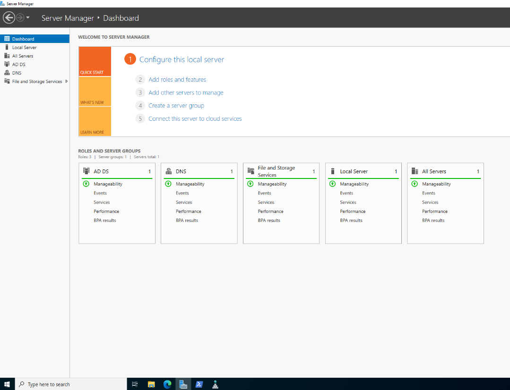

## 2. DNS

- **Forward lookup zones** `lab.internal` and `_msdcs.lab.internal` were created automatically during promotion (AD-integrated, domain replication scope). These hold the A records and the SRV service-locator records domain members use to find the DC.
- **Reverse lookup zone** for `10.0.10.0/24` (`10.0.10.in-addr.arpa`) was created manually — AD-integrated, domain replication scope, secure dynamic updates. AD does not create a reverse zone automatically; it depends only on the forward zone and SRV records, so the reverse zone is good-practice rather than required.
- **Forwarder** to pfSense (10.0.10.1) was inherited from the server's pre-promotion DNS config, so external resolution worked immediately. Resolution chain: client → DC → pfSense → public resolvers (1.1.1.1 / 9.9.9.9).

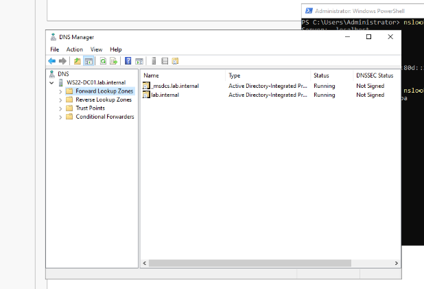
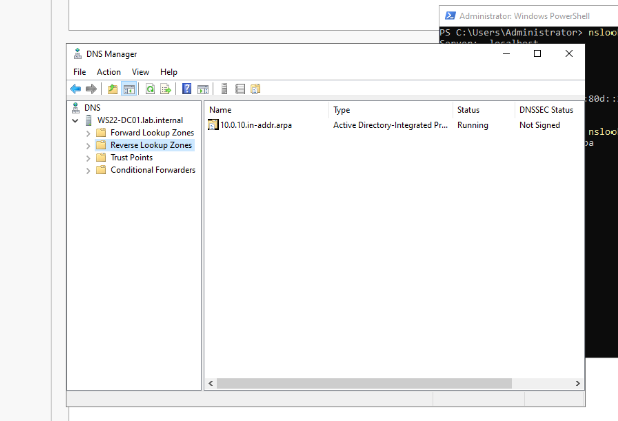

## 3. DHCP migration (pfSense → DC)

DHCP was moved off pfSense onto the DC for centralized management and to push domain-aware options to clients. Performed as a build-then-cutover so two DHCP servers never answered the LAN at the same time:

1. Installed the DHCP Server role on WS22-DC01 and **authorized it in AD** (a Windows DHCP server will not lease addresses until authorized).
2. Created scope **"Lab LAN - 10.0.10.0/24"**:
   - Range: 10.0.10.100 – 10.0.10.200, mask 255.255.255.0
   - Option 003 (Router): 10.0.10.1
   - Option 006 (DNS): **10.0.10.10** (the DC — required so clients can locate the domain)
   - Option 015 (DNS Domain Name): lab.internal
   - Lease: 8 days
3. Disabled the DHCP server on the pfSense LAN interface.
4. Released/renewed the client lease and confirmed it came from the DC.

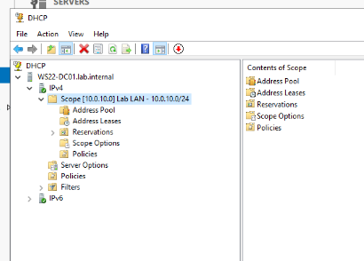
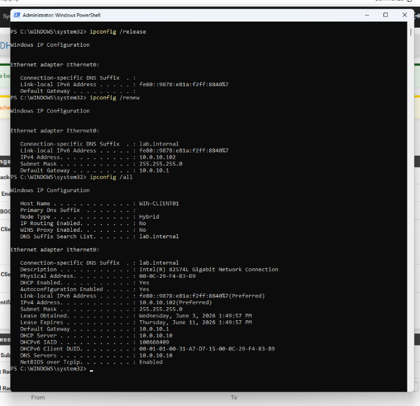

## 4. OU structure, users, and groups

Top-level OUs at the domain root: **Staff** (users), **Workstations**, **Servers**, **Groups**.

```
lab.internal
├── Staff          (user accounts)
├── Workstations   (client computer objects)
├── Servers        (member server computer objects)
└── Groups         (security groups)
```

- Test user: `jdoe` (John J. Doe), UPN `jdoe@lab.internal`, in the Staff OU.
- Security group: `IT-Admins` — Global / Security group in the Groups OU, with jdoe as a member.
- WIN-CLIENT01 computer object moved into the Workstations OU after domain join.

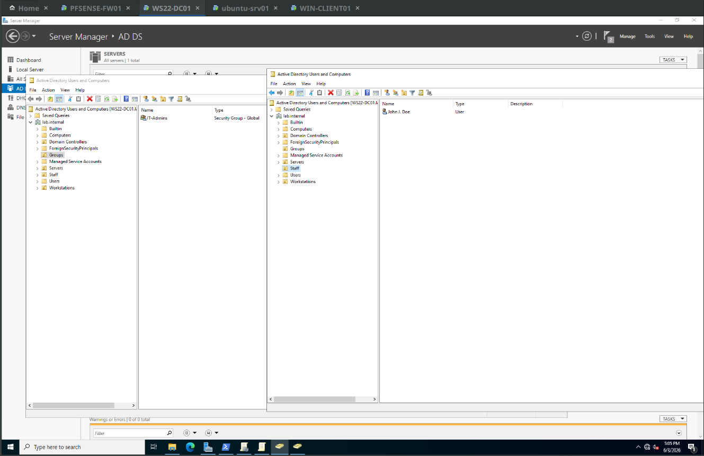

Design rationale is in [Appendix B](#appendix-b--ou-design-rationale).

## 5. First Group Policy

**"Staff Desktop"** GPO, linked to the Staff OU:
- User Configuration → Administrative Templates → Desktop → Desktop → **Desktop Wallpaper**, pointed at a UNC path under SYSVOL: `\\lab.internal\NETLOGON\Wallpapers\background.png` (equivalently `\\lab.internal\SYSVOL\lab.internal\scripts\Wallpapers\background.png`).

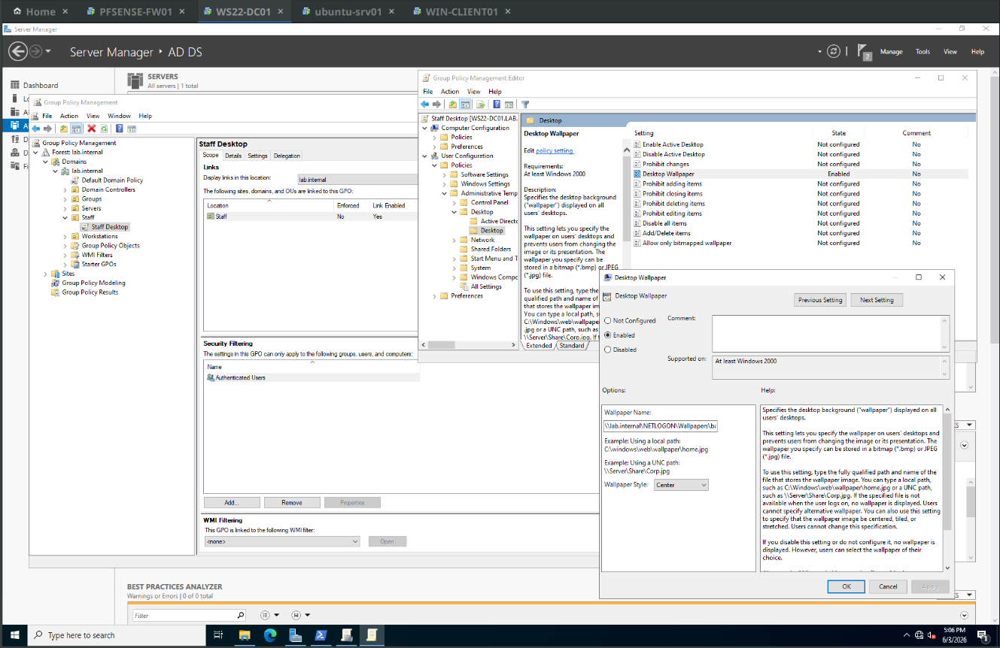

**Password-policy note:** the original plan called for enforcing password complexity via this GPO. Dropped — complexity is already enforced by the Default Domain Policy, and password policy only takes effect at the *domain* level (an OU-linked password policy affects local accounts only, not domain accounts).

A domain-wide GPO ("Allow ICMP Inbound," linked at the domain root) creates an inbound Windows Defender Firewall rule permitting ICMPv4 Echo Request, replacing the per-host rule from Phase 1. Verified by deleting the manual rule and confirming ping still succeeds — the GPO rule now supersedes it.

## 6. Domain join + verification

- Joined **WIN-CLIENT01** to `lab.internal` (authenticated as LAB\Administrator), rebooted. Its DNS already pointed at the DC (10.0.10.10) via the DHCP scope option, which is what let it locate the domain.
- Logged in as `jdoe`; the Staff Desktop wallpaper applied. Confirmed with `gpresult /r` showing the GPO in the applied list.
- `nslookup lab.internal` from the client returned 10.0.10.10.

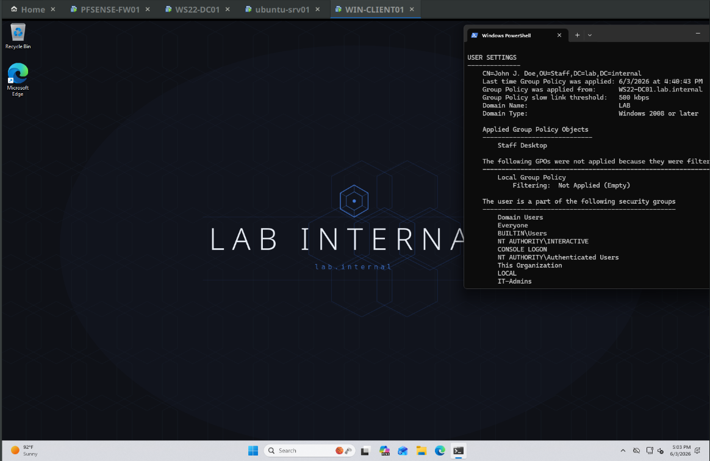
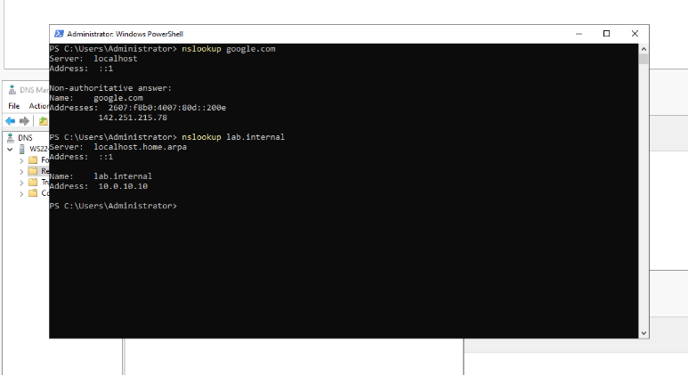

## Verification results

| Check | Result |
|---|---|
| `dcdiag` | Pass, except DFSREvent (expected — see Problems) |
| `nslookup lab.internal` (client) | 10.0.10.10 |
| `nslookup google.com` (via forwarder) | Resolved |
| Client DHCP lease | 10.0.10.102 from DHCP server 10.0.10.10 |
| Client DNS server | 10.0.10.10 |
| GPO application | "Staff Desktop" in `gpresult /r` applied list; wallpaper renders |

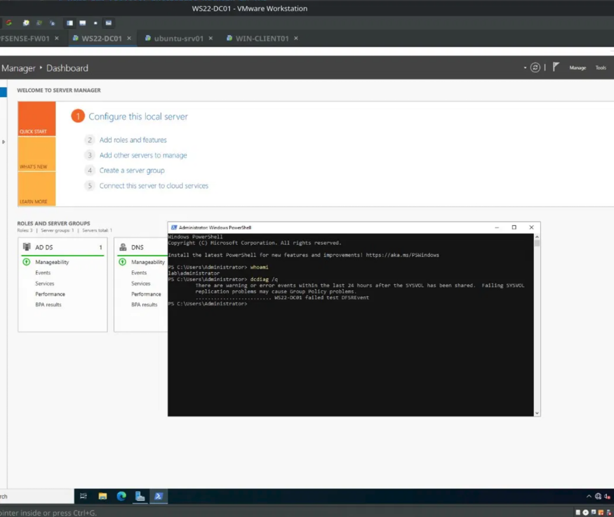

## Problems hit and how I solved them

**1. `dcdiag` reported `failed test DFSREvent` immediately after promotion.**
The DFSREvent test scans the DFS Replication event log for warnings/errors in the previous 24 hours. On a freshly promoted DC, SYSVOL initialization logs events that fall inside that window, so the test trips. Confirmed benign three ways: (a) this is a single DC, so there is no SYSVOL replication partner to fail; (b) `net share` showed SYSVOL and NETLOGON shared; (c) DFSR event **4602** ("SYSVOL replicated folder successfully initialized, designated primary member") was present. Once those events age out of the 24-hour window, the DFSREvent test passes. Takeaway: a single, explained DFSREvent on a fresh DC is initialization noise, not a fault.

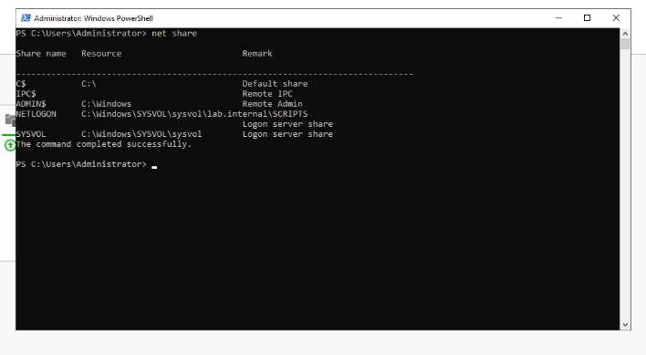
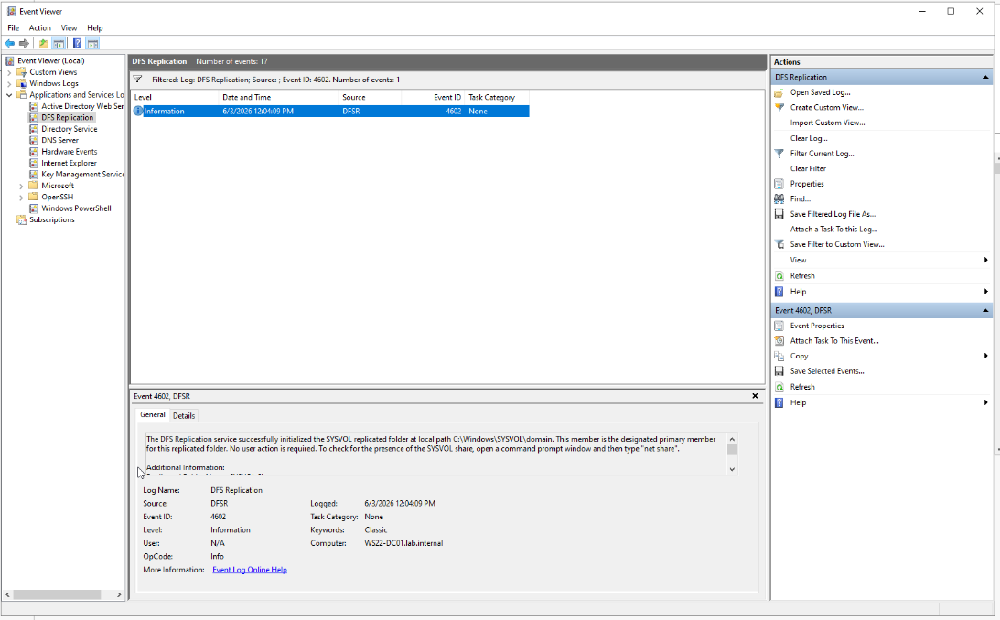

**2. Wallpaper GPO applied but the desktop was black.**
`gpresult` confirmed the GPO applied, so the policy delivered correctly — the client just couldn't fetch the image. Root cause was a malformed UNC path: the SYSVOL *share* already maps to `C:\Windows\SYSVOL\sysvol`, so the path contained a duplicated `sysvol` segment (`\\lab.internal\SYSVOL\sysvol\lab.internal\...`) that resolved to a non-existent folder. Corrected to `\\lab.internal\SYSVOL\lab.internal\scripts\Wallpapers\background.png`. Takeaway: `gpresult` confirms a GPO *applied*, not that a setting's value is valid.

**3. Could not create a "Users" OU — the name already existed.**
The built-in `Users` is a default *container* (`CN=Users`), not an OU, and can't have GPOs linked to it. Resolved by naming the users OU **Staff**, keeping the structure flat at the domain root.

**4. DNS forwarder showed "unable to resolve" for the pfSense FQDN.**
Cosmetic only — the console attempts a reverse (PTR) lookup on the forwarder IP for display, and pfSense has no PTR record. Forwarding works by IP; external resolution was verified via `nslookup google.com`.

## Next (Phase 3)
VLAN segmentation and re-IP: servers → 10.0.20.x, workstations → 10.0.30.x, DMZ → 10.0.40.x, with per-VLAN DHCP scopes. The DHCP scope and the reverse DNS zone built here will be revised accordingly.

---

## Appendix A — DC promotion PowerShell

Choices made in the promotion wizard: new forest `lab.internal`, NetBIOS `LAB`, functional level Windows Server 2016 (`WinThreshold`, the highest on Server 2022 — there is no "2022" level), DNS installed automatically, no DNS delegation (no parent zone), DSRM password set, default NTDS/SYSVOL paths, auto-reboot on completion.

As-run script (from the wizard's "View script"):

```powershell
#
# Windows PowerShell script for AD DS Deployment
#
Import-Module ADDSDeployment
Install-ADDSForest `
-CreateDnsDelegation:$false `
-DatabasePath "C:\Windows\NTDS" `
-DomainMode "WinThreshold" `
-DomainName "lab.internal" `
-DomainNetbiosName "LAB" `
-ForestMode "WinThreshold" `
-InstallDns:$true `
-LogPath "C:\Windows\NTDS" `
-NoRebootOnCompletion:$false `
-SysvolPath "C:\Windows\SYSVOL" `
-Force:$true
```

Post-promotion: AD DS + DNS roles present; `whoami` → `lab\administrator` (the local Administrator became the domain Administrator, password carried over).

## Appendix B — OU design rationale

**Why custom OUs instead of the built-in containers.** Group Policy can only be linked to OUs (and to sites / the domain) — *not* to the default `Users` or `Computers` containers. Any object that needs targeted policy therefore has to live in an OU.

**Why "Staff" and not "Users".** The built-in `Users` is a container (`CN=Users`), not an OU, so a second object named "Users" at the root is confusing and the container can't take GPOs anyway. The users OU was named **Staff** to avoid the collision and keep the structure flat.

**Why users / workstations / servers are separated.** They receive different Group Policy — a workstation lockdown shouldn't hit servers, user-experience settings target users, and so on. Separating object types keeps each OU a clean GPO target.

**OU vs. group.** OUs *organize* objects and are the unit for **GPO targeting** and **admin delegation**; an object lives in exactly one OU. Groups *grant access to resources* (permissions); a user can belong to many. The `Groups` OU simply holds group objects — it doesn't grant anything itself.

**Production note.** A larger or multi-site environment would typically nest these under a single top-level organization OU (e.g., `OU=LAB` → Users / Workstations / Servers / Groups) and shape the upper tiers around Group Policy and delegation needs (often geographic or functional) rather than mirroring the HR org chart. Kept flat here deliberately for lab scale.

## Appendix C — AD = LDAP demonstration

Active Directory Domain Services *is* an LDAP directory, with Kerberos, DNS-based service location, and Microsoft schema extensions on top. The same domain administered through ADUC is queryable over standard LDAP on TCP 389. This demonstrates that layer from a non-Windows host (ubuntu-srv01).

Prerequisite on ubuntu-srv01:

```bash
sudo apt update && sudo apt install -y ldap-utils
```

Queries (base DN `dc=lab,dc=internal`, DC at 10.0.10.10). AD restricts anonymous LDAP to little more than the RootDSE, so bind as a domain user to browse the directory:

```bash
# Authenticated query — list the OUs under the domain root
ldapsearch -x -H ldap://10.0.10.10 \
  -D "jdoe@lab.internal" -W \
  -b "dc=lab,dc=internal" \
  "(objectClass=organizationalUnit)" dn
```

```bash
# Anonymous RootDSE query — proves LDAP is listening and identifies the directory
ldapsearch -x -H ldap://10.0.10.10 -s base -b "" \
  defaultNamingContext dnsHostName
```

**Security Note:** This is a simple bind over plain LDAP (389), so the password crosses the wire in cleartext which is fine for my isolated lab, but in production I would use LDAPS (636) or StartTLS.

Output:

```
# extended LDIF
#
# LDAPv3
# base <dc=lab,dc=internal> with scope subtree
# filter: (objectClass=organizationalUnit)
# requesting: dn 
#

# Domain Controllers, lab.internal
dn: OU=Domain Controllers,DC=lab,DC=internal

# Workstations, lab.internal
dn: OU=Workstations,DC=lab,DC=internal

# Servers, lab.internal
dn: OU=Servers,DC=lab,DC=internal

# Groups, lab.internal
dn: OU=Groups,DC=lab,DC=internal

# Staff, lab.internal
dn: OU=Staff,DC=lab,DC=internal

# search reference
ref: ldap://ForestDnsZones.lab.internal/DC=ForestDnsZones,DC=lab,DC=internal

# search reference
ref: ldap://DomainDnsZones.lab.internal/DC=DomainDnsZones,DC=lab,DC=internal

# search reference
ref: ldap://lab.internal/CN=Configuration,DC=lab,DC=internal

# search result
search: 2
result: 0 Success

# numResponses: 9
# numEntries: 5
# numReferences: 3
```

What this shows: the OUs created in ADUC appear as LDAP `organizationalUnit` entries under `dc=lab,dc=internal`; AD objects map onto LDAP naming (domain → `dc=`, OUs → `ou=`, users/computers/groups → `cn=`); and a standard non-Microsoft LDAP client reaches the same directory the Windows tools manage — AD is LDAP underneath.
