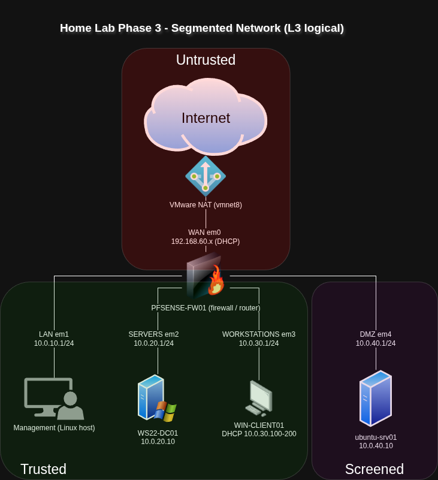
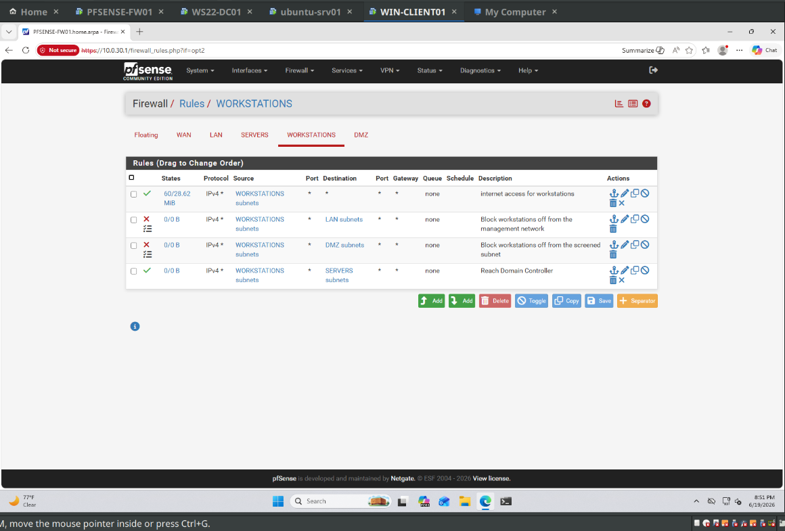
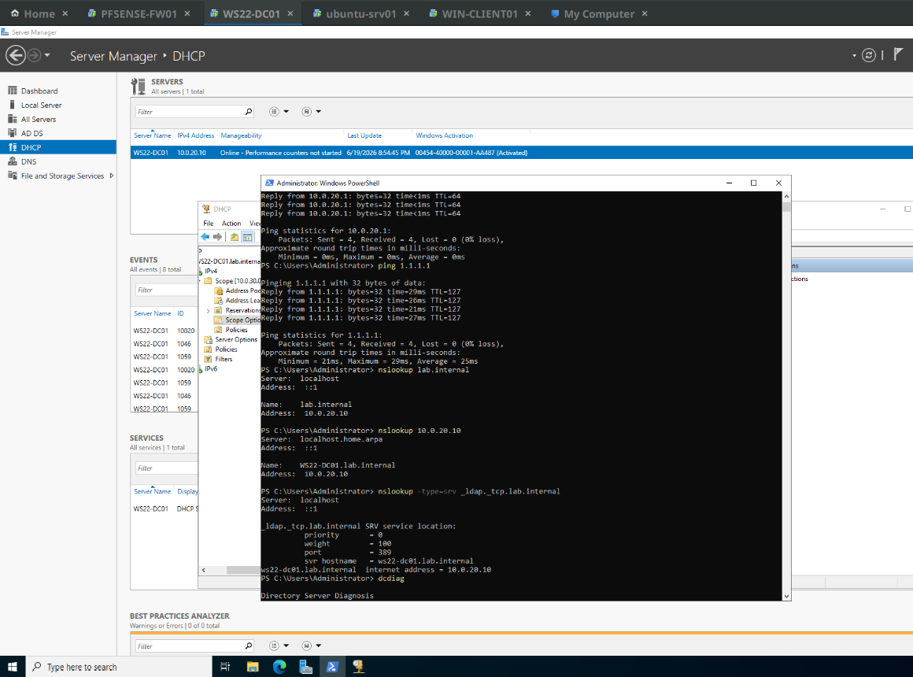
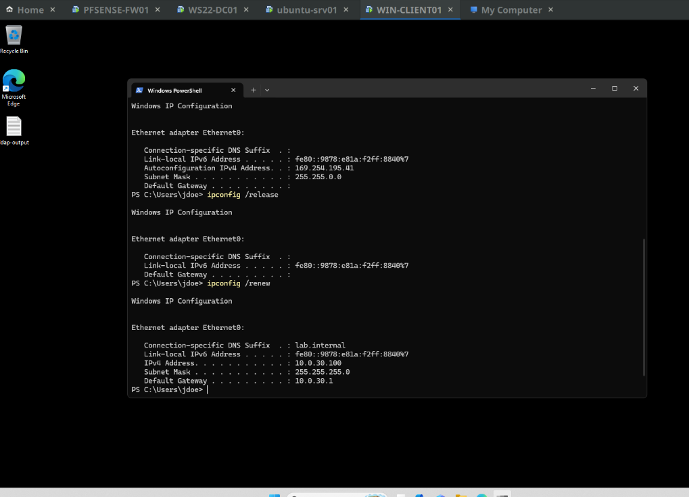

# Phase 3 — Network segmentation and re-IP

Phases 1 and 2 left me with a flat 10.0.10.0/24 network — every VM on one subnet behind pfSense. The goal for Phase 3 was to break that apart into separate segments with real firewall policy between them: a management network, a servers network, a workstations network, and a screened subnet (DMZ) for anything I'd treat as less trusted. pfSense handles all the routing and filtering between them.

## Addressing

The flat network became four subnets, each with pfSense as the .1 gateway:

| Segment | Subnet | pfSense interface | Gateway | Host |
|---|---|---|---|---|
| Management | 10.0.10.0/24 | em1 | 10.0.10.1 | Linux host (admin) |
| Servers | 10.0.20.0/24 | em2 | 10.0.20.1 | WS22-DC01 (10.0.20.10) |
| Workstations | 10.0.30.0/24 | em3 | 10.0.30.1 | WIN-CLIENT01 (DHCP .100–200) |
| Screened / DMZ | 10.0.40.0/24 | em4 | 10.0.40.1 | ubuntu-srv01 (10.0.40.10) |

## Why separate vmnets, not VLANs

The name of the phase is a bit of a misnomer because I'm not actually running 802.1Q VLANs. VMware Workstation doesn't pass VLAN tags through to Windows guests the way a real switch does, so instead of one trunk carrying tagged VLANs I gave each segment its own host-only vmnet and a dedicated pfSense interface. Functionally it's the same outcome of separate broadcast domains, segment routing through the firewall, and per-segment DHCP and policy — it's just done as separate L2 segments instead of tags on a trunk. On physical hardware this would collapse down to VLANs on a trunk port, but the routing and firewall design wouldn't change.

## Interfaces and firewall policy

After adding the three new interfaces (em2–em4) and giving each its .1 address, the firewall rules are where the actual segmentation lives. pfSense evaluates rules per interface, top-down (first match wins), with an invisible 'implicit deny' at the bottom — so a brand-new interface blocks everything until you add a pass rule. It's also stateful, so you only write rules for the direction a connection starts and the replies come back automatically (don't need to write a reverse rule).

The policy, per segment:

- **Management** — keeps the default allow-to-any. It's where I administer from.
- **Servers** — allow out to anything. The DC needs the internet for updates, NTP, and DNS forwarding, and it doesn't need to start connections into the other segments.
- **Workstations** — allow to Servers, block to the DMZ, block to Management, then allow to the internet. I kept the Servers rule broad on purpose: AD logon uses Kerberos, LDAP, SMB and a range of other ports, and locking it down to a neat port list quietly breaks domain logon. The two block rules sit *above* the internet allow, otherwise first-match would let the internal traffic through before it ever hit the blocks.
- **DMZ** — block to Servers, Workstations, and Management, then allow to the internet. If the Ubuntu box ever gets compromised, it can't reach back into anything internal. Logging is on for the block rules so denied attempts actually show up.

## DHCP relay

DHCP runs on the DC, but the clients now live on a different segment, so a broadcast DISCOVER won't reach it on its own. I turned on DHCP relay on the Workstations interface, pointing at the DC at 10.0.20.10. The relay stamps each request with the gateway address (10.0.30.1), and the DC uses that to pick the matching 10.0.30.0/24 scope.

## Moving the domain controller

This was the riskiest step, since the DC runs AD, DNS, and DHCP all at once. I moved its NIC onto the Servers vmnet and changed its IP to 10.0.20.10. The part that's easy to skip — and the reason a DC "breaks" after an IP change — is the DNS cleanup. I created reverse zones for the three new subnets, ran `ipconfig /registerdns`, restarted Netlogon (which re-registers the SRV records that tell clients where the DC lives) and the DNS service, deleted the stale 10.0.10.10 records, and pointed the forwarder at the new gateway. Then I rebuilt the DHCP scope for 10.0.30.0/24 with the router, DNS, and domain options.

Verified it afterward — forward, reverse, and the SRV lookup all resolving to 10.0.20.10:

## Verification

The whole point of the segmentation is that the right things are allowed and the wrong things are blocked, so I worked through a test matrix:

| Flow | Test | Expected | Result |
|---|---|---|---|
| Workstations → Servers | domain logon, GPO applies | allow | pass |
| Workstations → Internet | `ping 1.1.1.1` | allow | pass |
| Workstations → DMZ | `Test-NetConnection 10.0.40.10 -Port 22` | block | blocked |
| Workstations → Management | `ping 10.0.10.1` | block | blocked |
| Servers → Internet | `ping 1.1.1.1` | allow | pass |
| DMZ → Servers | `ping 10.0.20.10` | block | blocked (100% loss) |
| DMZ → Internet | `ping google.com` | allow | pass |
| Internet → inside | no WAN port-forwards | block | default deny |

The two block results are the ones that matter most — they're the proof the screened subnet and the workstation isolation actually hold.

## What broke

The one that got me: after moving everything across, the client booted with an APIPA address (169.254.x.x) and the desktop GPO wasn't applying. I started by second-guessing the DHCP relay and the scope, but the real cause was dumber — I'd forgotten to switch the client VM's NIC over to the Workstations vmnet, so it was sitting on a segment with no DHCP server and falling back to APIPA. No valid IP meant no route to the DC, which is also why the GPO never ran. Moved the NIC to vmnet3, ran `ipconfig /release` and `/renew`, and it pulled 10.0.30.100. A `gpupdate /force` and a re-logon brought the wallpaper back.

The DC re-IP drove home the same lesson from the other direction: changing a domain controller's address isn't just an IP change. Without the DNS re-registration above, clients would still have been looking for it at the old address.