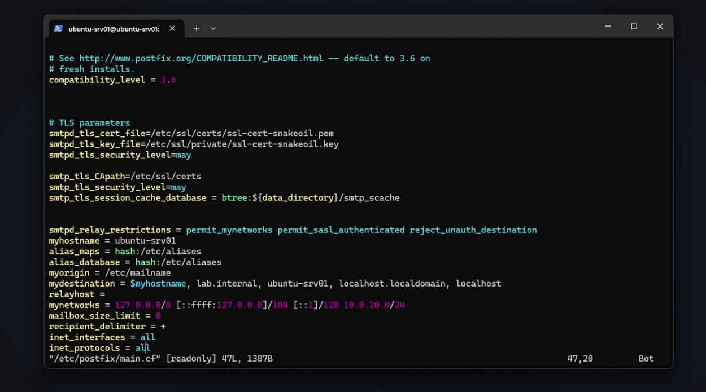
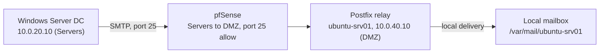
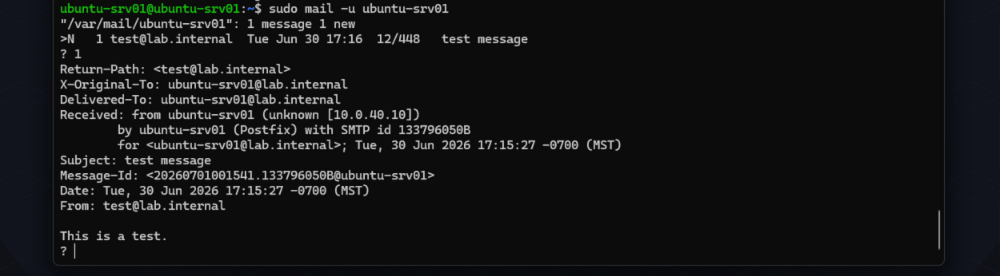
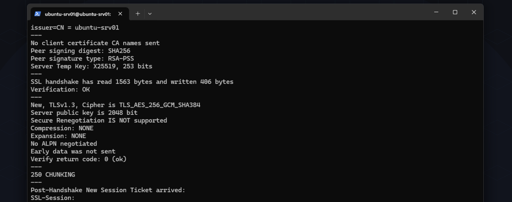
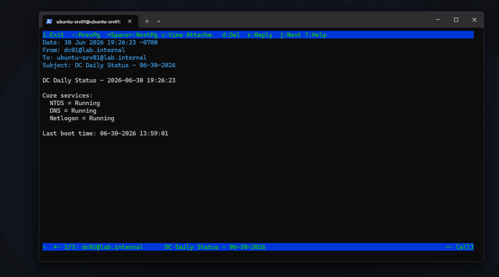

# Phase 4 - SMTP & email infrastructure

Phase 3 got the network segmented and the DC re-IP'd onto the Servers subnet. Phase 4 was about giving the Ubuntu box in the DMZ an actual job: an internal-only SMTP relay that the DC can send mail through, with the DC sending a real daily status email as the proof it works.

## Setting up the relay

Postfix went on with `apt install postfix`, choosing Internet Site during the install prompt rather than Local only, since Local only binds to loopback and the DC would never be able to reach it. From there it was a matter of locking main.cf down to internal-only instead of Postfix's public-mail-server defaults: `inet_interfaces = all` so it actually listens on the LAN interface, `mynetworks` scoped to just the Servers subnet so nothing else can relay through it, `mydestination` including the lab domain so local delivery actually resolves, and `relayhost` left empty since there's no smarthost to forward to. `smtpd_relay_restrictions` uses `reject_unauth_destination` instead of the default `defer` - since I know exactly what's allowed to relay here, a permanent rejection is the more honest answer than telling an unauthorized sender to try again later.

TLS turned out to already be half done for me - Ubuntu's Postfix package wires up the distro's self-signed snakeoil cert automatically with opportunistic STARTTLS on install, so that part came for free rather than something I had to configure.

Mail name got set to lab.internal during install, matching the domain I'm already using on the DC's DNS server, so mail addresses and any future DNS TXT records stay under one consistent namespace instead of two unrelated ones.

## Firewall changes

WORKSTATIONS had a block rule to DMZ from Phase 3, which is correct by default but meant I couldn't SSH into the relay from my admin machine or test SMTP against it. Rather than removing the block, I added two narrow pass rules above it - one for TCP 22, one for TCP 25 - so administrative and test traffic gets through while everything else to the DMZ stays shut. First-match-wins means the specific allow catches the traffic before it ever reaches the block underneath it.

SERVERS needed the same treatment for the DC to actually reach the relay - it didn't have blanket DMZ access by default, so a SERVERS -> DMZ, TCP/25 pass rule was required.

While in there I also caught and fixed an unrelated bug left over from Phase 3: the WORKSTATIONS ruleset had a broad pass-to-any rule sitting above the intended blocks to LAN and DMZ, which made both blocks dead since pfSense stops at the first match. Workstations could reach the management network and the DMZ despite rules that looked correct at a glance. Reordering so the blocks sit above the catch-all closed that hole.

## Mail flow

Right now mail terminates locally on the relay - there's no public domain to forward outbound to. In a real deployment this would push out to a public MX or smarthost, with SPF, DKIM, and DMARC published at the domain (more on those below).

## Testing it

Rather than trusting the config and moving straight to the PowerShell script, I worked through each layer separately so a failure would point at exactly where the problem was instead of leaving me guessing between the network, Postfix, or the script.

| Test | Method | Result |
|---|---|---|
| TCP reachability | `Test-NetConnection 10.0.40.10 -Port 25` from the DC | failed until the firewall rule was added, then passed |
| SMTP conversation | manual HELO / MAIL FROM / RCPT TO / DATA over `nc 10.0.40.10 25` | accepted and queued |
| Local delivery | checked `/var/mail/ubuntu-srv01` | message present |
| STARTTLS | `openssl s_client -starttls smtp -connect 10.0.40.10:25` | full TLS 1.3 handshake, TLS_AES_256_GCM_SHA384 |
| Real end-to-end send | PowerShell script run from the DC | delivered, headers show it actually came from 10.0.20.10 over the network |
| Unattended run | scheduled task fired manually through Task Scheduler | delivered |

## What broke

The mynetworks line was the first real snag: I wrote `10.0.20.10/24` instead of `10.0.20.0/24` - a host address where a network address belongs. Postfix didn't fail to start over it, it just quietly broke the recipient lookup, which showed up as a `451 4.3.0 Temporary lookup failure` at RCPT TO with no obvious connection back to the typo. Postfix actually logs a clear warning about it in mail.log ("non-null host address bits"), which was faster to find than staring at the config file trying to spot a one-character mistake by eye.

The second one was dumber and took longer to run down. Installing Postfix kept failing partway through with a fatal error about myorigin containing multiple values, and it kept happening across several edits to main.cf that all looked clean. Turned out the corruption wasn't in main.cf at all - it was in /etc/mailname, which myorigin reads from. VMware's clipboard sharing isn't scoped to the focused window, so a paste I made somewhere else on the host had silently also pasted stale clipboard text into the Postfix install dialog earlier in the session, jamming a leftover SSH command onto the end of "lab.internal." Every edit to main.cf was fixing a file that was never actually broken. Tracking it down meant using `postconf -n` to see what Postfix itself was actually parsing, rather than trusting that the file I was looking at was the one causing the problem.

Separately, and not really a Phase 4 issue, WIN-CLIENT01 dropped to an APIPA address again this session after a VMware suspend and resume - same symptom as the Phase 3 writeup, different cause. I chased the DMZ firewall rules for a while since reordering them happened to coincide with the lease coming back, but that didn't hold up: the ruleset before the reorder was if anything more permissive toward DHCP traffic, not less, so it couldn't have been the fix. Best explanation is a stale pf state left over from the suspend, cleared by the filter reload that saving the firewall change triggers. Worth remembering for next time - reset states or reload the filter after a suspend/resume before assuming it's a config problem.

## The Windows side

[Send-DCStatusEmail.ps1](../scripts/Send-DCStatusEmail.ps1)

The DC runs a PowerShell script (Send-DCStatusEmail.ps1) daily via Task Scheduler, checking NTDS, DNS, and Netlogon and emailing the result through the relay. It uses Send-MailMessage, which Microsoft has marked deprecated since it doesn't handle modern auth or TLS well - fine here since this is an unauthenticated internal relay with nothing modern-auth-dependent, but not something I'd carry into a production script.

## Email security - SPF, DKIM, DMARC

These three exist because plain SMTP has no built-in way to verify a message's sender is who it claims to be. SPF is a DNS TXT record listing which servers are allowed to send mail for a domain, so a receiver can check the connecting server against that list. DKIM adds a cryptographic signature to outgoing mail, verified against a public key published in another TXT record, proving the message wasn't altered in transit. DMARC sits on top of both, requiring that SPF or DKIM actually align with the visible From address, stating a policy for what to do on failure (none, quarantine, or reject), and providing reporting back to the domain owner.

All three depend on a public, resolvable domain with authoritative DNS, which lab.internal isn't, so there's no way to fully implement them here - but the mechanism is the same one a real domain would use, and it's the direct answer to why TXT records matter beyond just SPF and DKIM specifically.
