# Phase 5 — File Shares, Group Policy, and Finally Automating User Creation

Phases 1-4 got me a segmented network, a domain, and a mail relay that emails me about my domain controller's health. Phase 5 is the day-to-day sysadmin stuff: a departmental file share locked down with security groups, a handful of Group Policy Objects, and a PowerShell script that provisions AD users from a CSV. Less glamorous than firewall rules, but this is the work the actual job postings describe, so it felt like time to prove I can do it.

Everything here runs on the existing lab: WS22-DC01 (Windows Server 2022, AD DS/DNS/DHCP) and WIN-CLIENT01 (Windows 11) behind pfSense. First move, as always, was a VMware snapshot of the DC before touching anything.

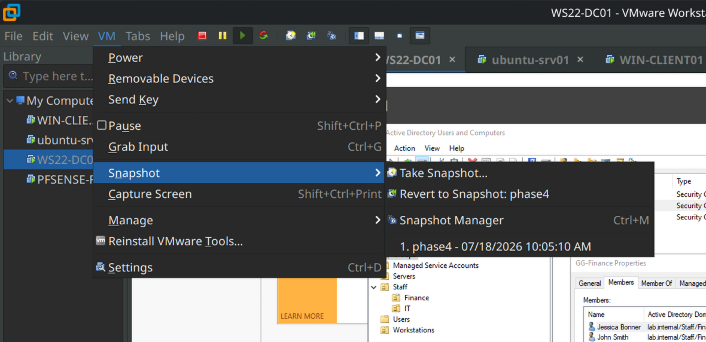

## Building out the OU structure

My existing layout already had custom OUs (Staff, Groups, Servers, Workstations) from earlier phases, so instead of rebuilding to some textbook structure, I extended what was there: two department OUs under Staff, Finance and IT, and six test users split between them. I filled in the Job Title and Department attributes on every account even though nothing consumes them yet.

Creating the users manually was tedious. That's intentional. The whole arc of this phase is "do it by hand, get annoyed, automate it," and you can't get properly annoyed secondhand.

While moving my original test account into the IT OU, Windows threw a warning about how moving objects can break things. Worth understanding rather than dismissing: moving a user between OUs doesn't touch their SID or group memberships — permissions survive the move — but it *does* change which GPOs apply, because policy comes from where an object sits in the tree. The one-sentence version I keep in my head now: **in AD, location determines policy, identity determines permissions.**

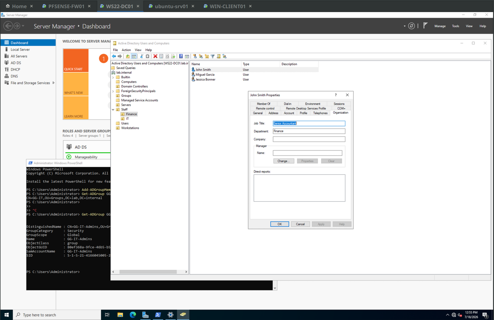

## Groups, and the AGDLP thing

For access control I used the AGDLP pattern: Accounts go into Global groups (departments), Global groups go into Domain Local groups (permissions on a resource), and permissions land on the Domain Local group. So GG-Finance and GG-IT hold people; DL-Finance-Modify and DL-IT-Modify hold the actual NTFS grants. The middle step looks redundant until you need to give Finance read access to an IT folder — then it's just a membership change instead of restructuring anything.

One deliberate design decision: I already had an IT-Admins group, so I renamed it GG-IT-Admins and nested it *inside* GG-IT. The mental model is that GG-IT is the whole department (help desk included) and GG-IT-Admins is the elevated subset — admins should get everything the department gets, plus more. Group nesting makes that automatic. I did the nesting in PowerShell rather than the GUI, partly to start getting the ActiveDirectory module under my fingers:

```powershell
Add-ADGroupMember -Identity GG-IT -Members GG-IT-Admins
```

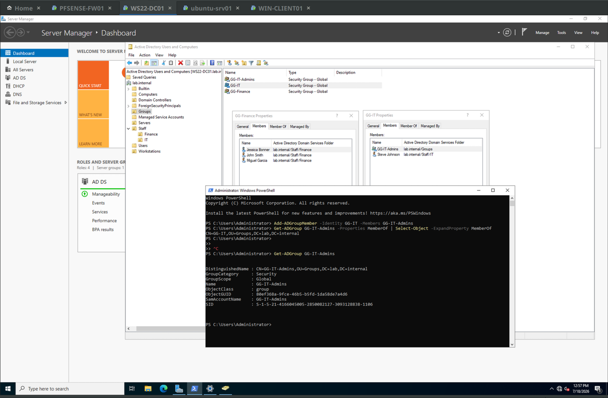

## The share

I created `C:\Shares\Departments` with Finance and IT subfolders and shared the parent as `Departments`. (Yes, shares on a DC's C: drive is a lab compromise, noted and accepted. Real environments use a member file server and a data volume.)

Before touching share settings I did the NTFS work, and this is where the phase got interesting. First step on each department folder: disable inheritance and convert the inherited entries to explicit ones, then look at what actually came down from C:\. Answer: more than I expected. Beyond the read access for Users, the default C:\ ACL includes special-permission entries letting Users *create files and folders* — which had inherited straight into my "locked down" share's parent folder. Nobody would have noticed until random files started appearing next to the department folders. I removed those, removed CREATOR OWNER from the department folders, and granted each DL-Modify group Modify rights.

CREATOR OWNER deserves its own paragraph because the right answer depends on the share. It's a placeholder that stamps the file creator's permissions onto anything they make. On a *home directory* share that's exactly what you want. On a *collaborative departmental* share, its default of Full Control means any user can re-ACL their own files and lock out their teammates — per-file permission drift inside a share that's supposed to be centrally controlled. Since DL-Finance-Modify already covers create/edit/delete, CREATOR OWNER was pure unintended privilege so I removed it.

The parent folder kept a single narrow grant: Users with Read & execute, **this folder only**. You can't just strip everything from the container — users need to traverse *through* it to reach the child folders, so a locked-down share still needs a deliberate, scoped grant one level up. Deny everything at the parent and the share simply becomes unreachable, with perfectly correct-looking ACLs on the children.

Share-level permissions: Everyone removed, Authenticated Users granted Full Control. That sounds backwards until you know the rule — when share and NTFS permissions both apply, the most restrictive wins, so the standard practice is to leave the share wide open and let NTFS be the single source of truth. Two competing permission systems is one too many to troubleshoot.

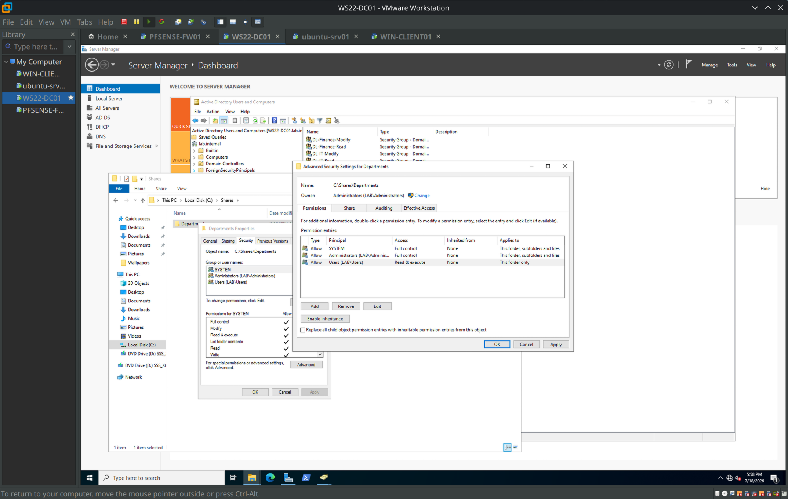

## Testing it (and the folder that shouldn't be visible)

From WIN-CLIENT01 as jsmith (Finance): the Finance folder opened, and I created a couple of files — TPS-Report-Q2, and one called passwords.txt, which is empty, and which I'm keeping because it's funny. The IT folder threw access denied, as designed.


Then the better test: logging in as Stacy Harris, who is in GG-IT-**Admins**, not GG-IT directly. Her access to the IT folder has to flow through two hops of nesting — GG-IT-Admins → GG-IT → DL-IT-Modify — and it worked. `whoami /groups` shows the whole chain sitting in the token: she was added to exactly one group, and all three show up.

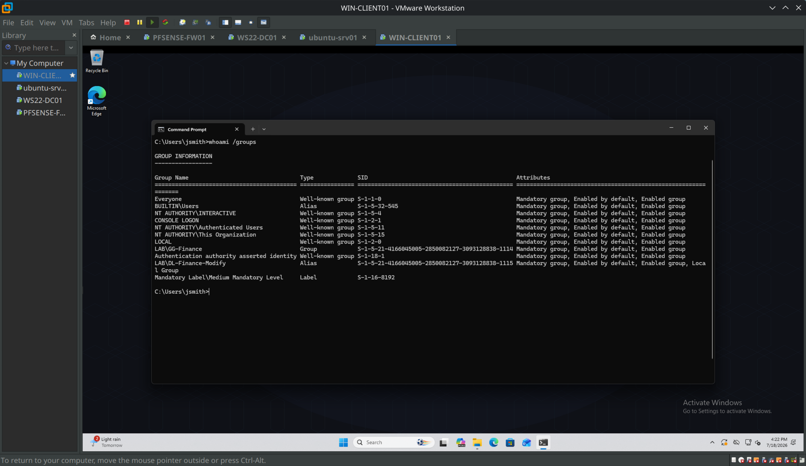

One thing bugged me though: jsmith could *see* the IT folder he couldn't open. Folder names alone leak information — think `\Departments\Layoffs-Q3` visible to the whole company. That's what Access-Based Enumeration fixes. One checkbox on the share (Server Manager → File and Storage Services → share properties → settings), and the IT folder vanished from jsmith's view entirely. Same permissions, different visibility.

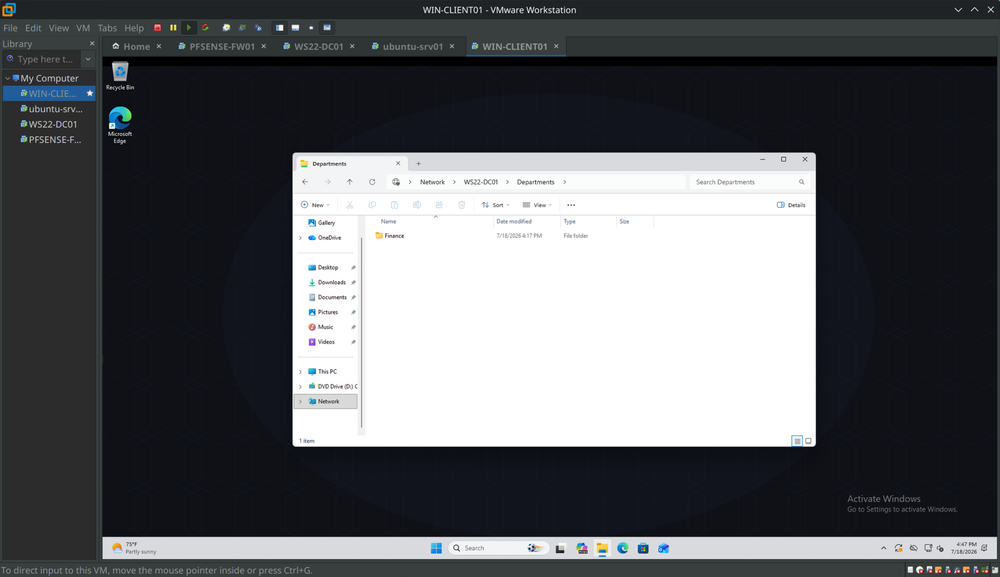

## Breaking it on purpose

To actually prove the "most restrictive wins" rule instead of just repeating it, I set the share permission down to Read while NTFS still said Modify. One gotcha before testing: SMB caches sessions, so you have to drop the connection (`net use \\WS22-DC01\Departments /delete`) or the client keeps its old permissions and you get a false result.

Result: jsmith could open and read files fine, but creating or saving anything failed — while the folder's Security tab, checked as jsmith, still showed DL-Finance-Modify with Modify. This is the trap in ticket form: "user can read but not write, and the permissions look correct." The NTFS ACL you'd naturally inspect first is telling the truth about NTFS and nothing else.

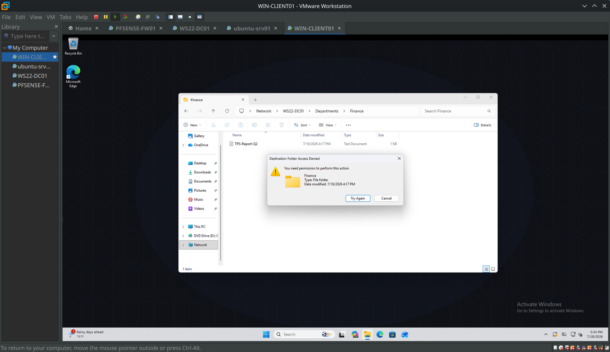

Here's where I got a genuinely useful surprise. I expected the Effective Access tool to be useless for this — the old behavior was that it evaluated NTFS only and would confidently report Modify. Turns out Server 2022's version is smarter: it reported Read, and the "Access limited by" column explicitly said **Share** for the write operations. It evaluates both layers and tells you which one is the limiter. I went in expecting to document a tool's blind spot and instead documented that the tool got fixed at some point when I wasn't looking.

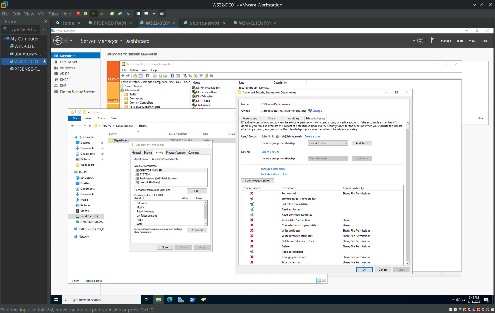

Restored the share to Full Control, dropped the session again, confirmed writes came back.

## Group Policy, and the mistake I made on purpose

The plan was a password/lockout policy, and I linked it where intuition says it goes: on the Staff OU, where the users live. Minimum length 12, complexity on, max age 90, history 5, lockout after 5 bad attempts.

Then `net accounts /domain` on the client, and none of my numbers were there. Minimum length 7, max age 42, history 24, lockout Never — the stock Default Domain Policy values, completely unmoved by my GPO. No error anywhere. The GPO editor shows my settings, the link shows enabled, gpresult happily lists policy processing, and the domain ignores all of it.

The rule, which I'd argue is the single most misunderstood thing in Group Policy: **account policies for domain accounts only work at the domain level.** There is exactly one password policy per domain, enforced by the DCs. Link those same settings to an OU and they aren't dead — they configure the *local* SAM accounts of computers in that OU — but they will never touch domain users. Silently.

The fix taught me something about GPO architecture too. I asked whether I could just drag my GPO up to the domain — you can't, because what sits under an OU isn't the GPO, it's a *link* to it. The GPO lives once in the Group Policy Objects container; links are pointers. So: link the existing GPO at the domain root, bump it above Default Domain Policy in link order, delete the OU link. Then `gpupdate /force` and the before/after in one terminal:


7 → 12, 42 → 90, 24 → 5, Never → 5. Same GPO, same settings, only the link location changed.

Two footnotes from this section. First, my earlier "test" of the password policy had actually passed for the wrong reason — I tried changing a password to something weak and it was rejected, but by the *default* policy's complexity rule, not mine. The test looked green while my policy did nothing. Validate the mechanism, not just the outcome. Second, when I reviewed the final applied values, minimum password age was 30 days — a setting I never consciously chose, which came along as an editor default when I configured the section. Harmless here; in production, a 30-day minimum age means anyone who suspects their password leaked can't rotate it without calling the help desk. Review the whole policy section before linking, not just the lines you typed.

(For per-group password rules — like requiring 16 characters for admins only — the answer isn't OU-linked GPOs, it's Fine-Grained Password Policies applied to groups. On the list for a future phase.)

## Drive maps

Last GPO piece: department drive mappings, and these live in a different half of Group Policy than everything above. Policies are enforced and revert when the GPO goes away; **Preferences** (originally a bolted-on acquisition) just set things, users can change them, and many of them tattoo — remove the GPO and the setting stays behind.

I built one GPO on the Staff OU with two Drive Map preferences: F: → the Finance folder, I: → the IT folder. Action set to **Update** rather than Create (Update creates-if-missing and refreshes-if-present; Create silently does nothing on machines where the drive already exists). The part that makes one GPO serve both departments is **item-level targeting**: each mapping is filtered to its security group on the Common tab, so the preference only applies if the user's token contains GG-Finance or GG-IT respectively.

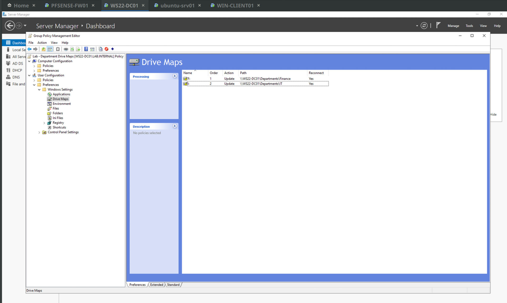

Logged in as jsmith: F: mapped, no I:. Logged in as Stacy Harris: I: mapped, no F: — and again, her GG-IT membership is transitive through the admin group, so this also confirmed item-level targeting evaluates the full nested token, not just direct memberships.

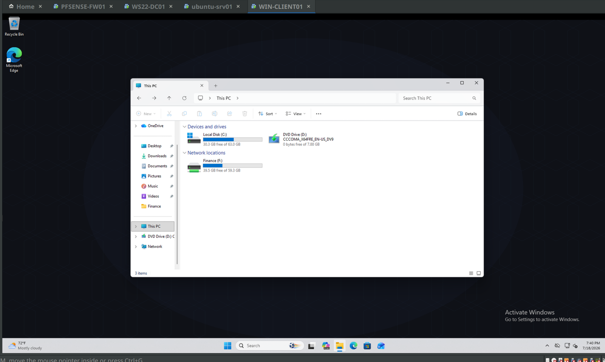

At this point every layer built in this phase is visible in one login: OU placement decides which GPOs you get, group membership decides which drive appears, NTFS decides what you can do inside it.

## The script

Six users created by hand in session one. Time to never do that again.

`New-LabUsersFromCsv.ps1` reads a CSV of new hires and provisions each one: creates the account in the right OU, sets the attributes, adds the department group membership, and sets a temp password with change-at-first-logon forced. The CSV deliberately carries almost nothing — name, username, department, title. The OU path and group name are *derived* from the Department column inside the script (`Finance` becomes `OU=Finance,OU=Staff,DC=lab,DC=internal` and `GG-Finance`), because data should stay minimal and logic should live in code.

```powershell
$Users = Import-Csv -Path "C:\Scripts\new-users.csv"
$Domain = "DC=lab,DC=internal"

foreach ($User in $Users) {

    $OUPath    = "OU=$($User.Department),OU=Staff,$Domain"
    $GroupName = "GG-$($User.Department)"
    $UPN       = "$($User.SamAccountName)@lab.internal"
    $Password  = ConvertTo-SecureString "TempP@ssw0rd2026!" -AsPlainText -Force

    New-ADUser `
        -Name              "$($User.FirstName) $($User.LastName)" `
        -GivenName         $User.FirstName `
        -Surname           $User.LastName `
        -SamAccountName    $User.SamAccountName `
        -UserPrincipalName $UPN `
        -Department        $User.Department `
        -Title             $User.Title `
        -Path              $OUPath `
        -AccountPassword   $Password `
        -ChangePasswordAtLogon $true `
        -Enabled           $true

    Add-ADGroupMember -Identity $GroupName -Members $User.SamAccountName

    Write-Host "Created $($User.SamAccountName) in $($User.Department)"
}
```

I wrote it in stages — first a loop that only printed what it *would* create, run against the CSV to prove the parsing, then the real thing. A `New-ADUser` failure halfway through a loop leaves you a partially-provisioned mess to clean up; a dry run costs thirty seconds.

Two honest notes. The hardcoded plaintext password is a lab shortcut and would be wrong in production — the real version prompts with `Read-Host -AsSecureString` or generates per-user randoms. And `-ChangePasswordAtLogon $true` is the deliberate inverse of the convenience checkbox I used for my manual test users; provision-with-temp, force-change-at-first-logon is the standard, and now the script enforces it instead of relying on me remembering.

Four users provisioned in one run, verified with `Get-ADUser` showing department, title, and group membership all landed:

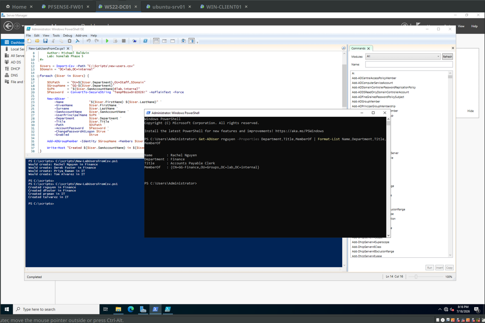

The manual users took minutes each. These took one command, and forty would take the same command. That's the entire argument for the phase.

## What I'd tell someone walking into this

The distinction that organizes everything here: permissions answer *what can you access* and attach to resources via groups; policy answers *how is your environment configured* and attaches to users and computers via OU placement. When a Finance user logs in and gets F: mapped, that's policy. Whether they can open what's inside F: is permissions. Half of troubleshooting "user can't get to their files" is figuring out which of the two actually failed — and as the break-test showed, sometimes the answer is a third thing (the share layer) that neither tab shows you.

Next phase: Docker on the Ubuntu box, starting with a monitoring workload.

## Phase 4 infrastructure

I thought I would make a note about this: as I was shutting down my VMs I switched to the Ubuntu console and decided to check my mail by running 'mutt' out of curiosity. Sure enough I had a new mail message from today. As I was configuring these new GPOs my Phase 4 PowerShell script ran from Task Scheduler and sent the status email to the Postfix relay — it was nice to see that it was still working as intended!