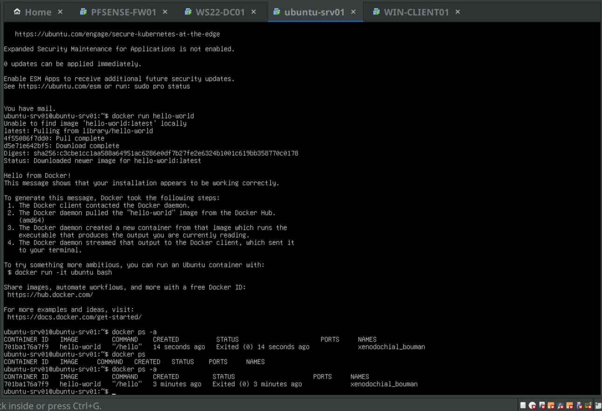
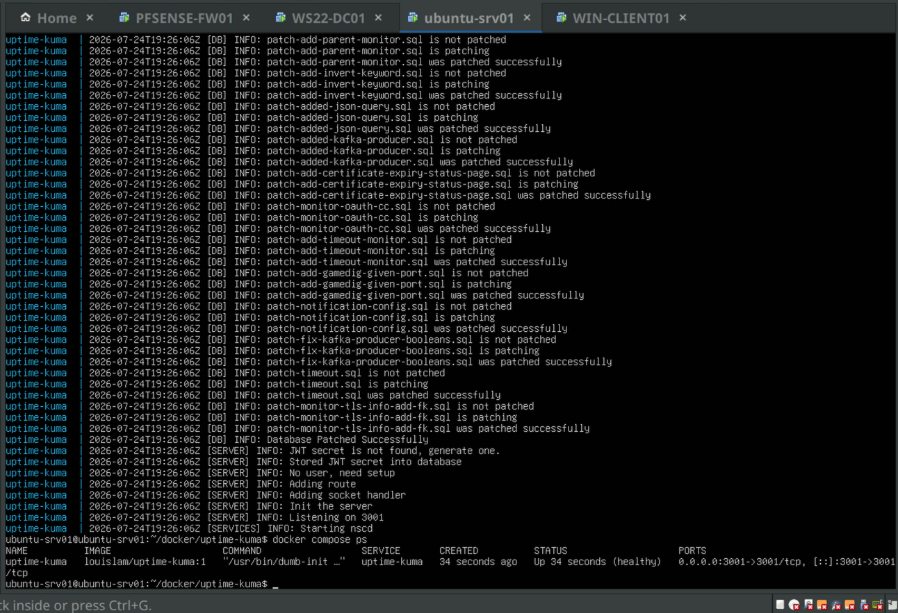
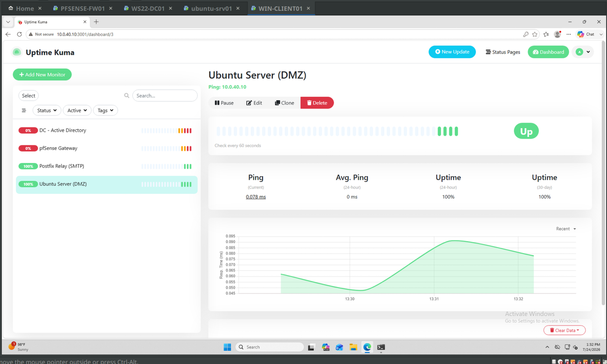
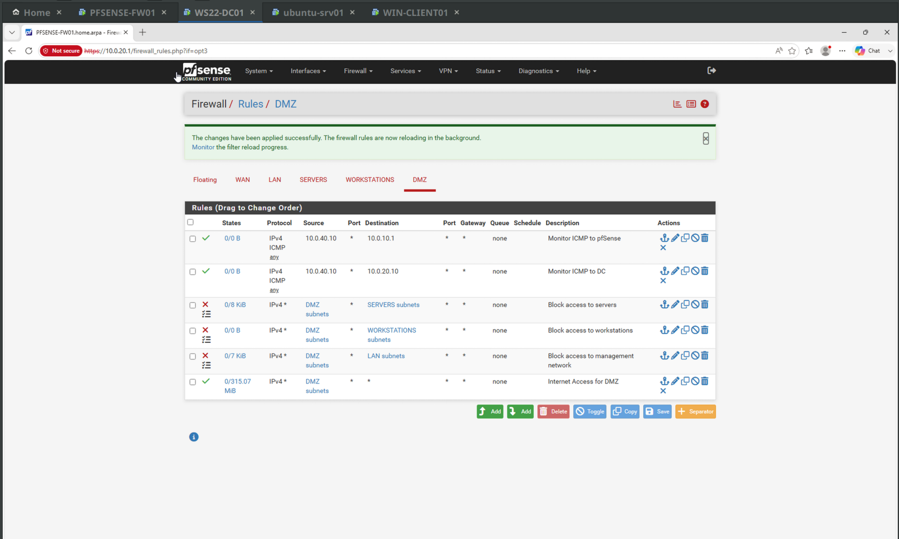
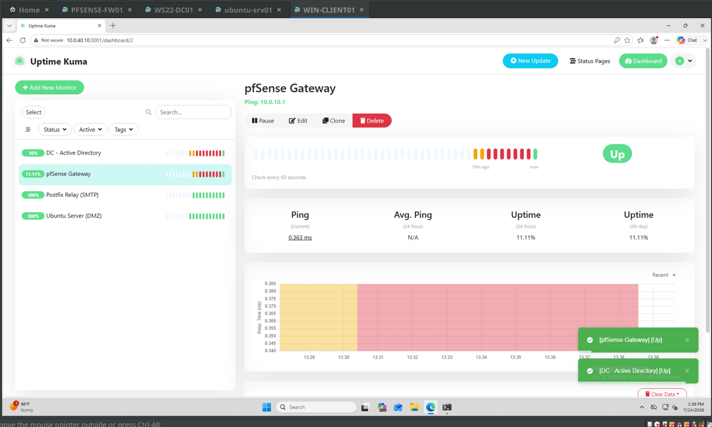
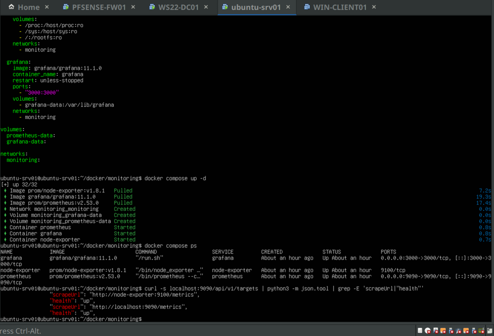
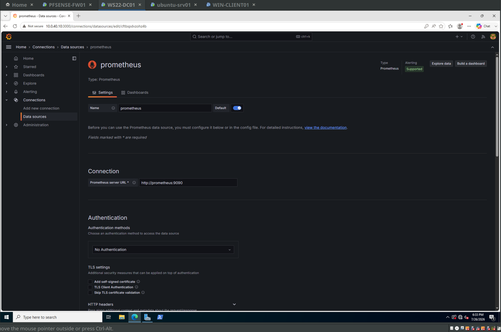
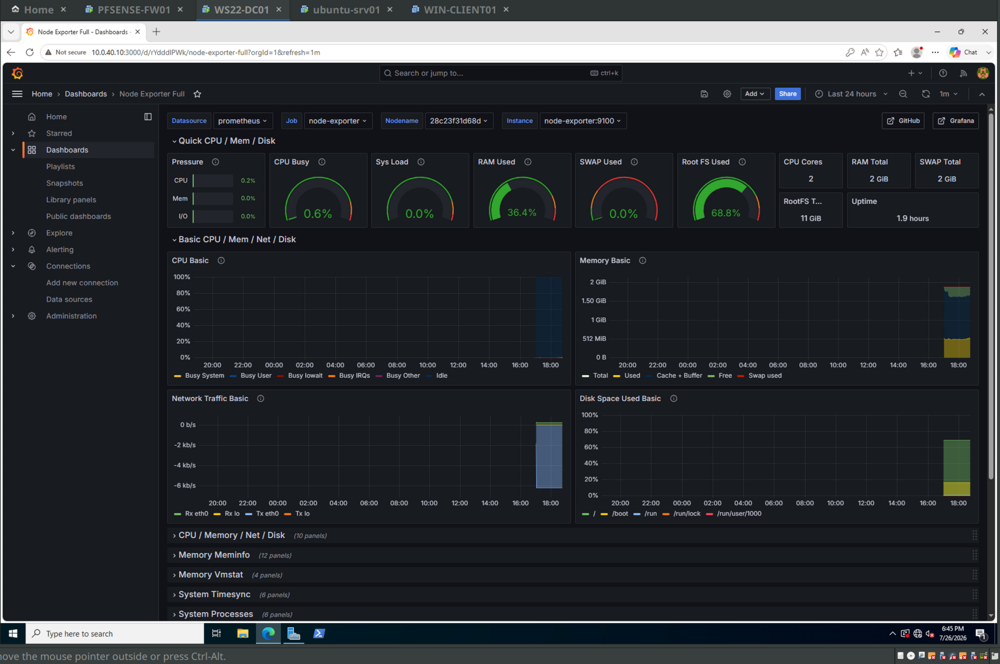

# Phase 6 — Docker on ubuntu-srv01: Uptime Kuma, then Prometheus + Grafana

Phases 1 through 5 got me a segmented network, a domain, file shares, GPO, and a PowerShell provisioning script. What I didn't have was any way to know whether any of it was actually up without logging into each box and looking. So Phase 6 is containers, and the first real workload is monitoring.

Two stacks, deployed separately on purpose. Uptime Kuma first, because it's simple and it gives me something useful immediately. Then Prometheus + Grafana + node-exporter as a second, independent stack, because I wanted to be forced into container-to-container networking instead of running one container and calling it Docker.

Everything runs on ubuntu-srv01 (10.0.40.10, DMZ).

---

## Docker Engine

Installed from the official Docker apt repo rather than the `docker.io` package in Ubuntu's repos. Added my user to the `docker` group so I'm not typing `sudo` in front of every command.

Worth being honest about what that group membership means: the Docker daemon runs as root, and anyone who can talk to its socket can start a container that mounts the host filesystem and effectively become root. Being in the `docker` group is not a small convenience, it's root-equivalent. Fine for a lab box, worth flagging if I ever do this somewhere real.

`docker run hello-world` pulled and exited cleanly.



The detail I actually wanted from that screenshot is `docker ps` vs `docker ps -a`. The container ran, printed, and exited, so it's invisible to `docker ps` but still sitting there in `docker ps -a` with status `Exited (0)`. Containers don't disappear when they stop. They pile up until you clean them out. That's the first thing about Docker that isn't obvious coming from VMs, where a machine is either on or off and never "off but still taking up a slot in the list."

---

## Uptime Kuma

Deployed with docker-compose into `~/docker/uptime-kuma/`, with a named volume so the monitor config and history survive a container recreate. This is the part that took me a minute to internalize: the container filesystem is disposable. Recreate the container and anything written inside it is gone. A volume is how you say "this specific directory is data, keep it."



Four monitors: pfSense gateway, the DC, ubuntu-srv01 itself, and the Postfix relay.

Then it half worked.



Postfix and the local Ubuntu check were green. pfSense and the DC were both sitting at 0% uptime. Which, if you think about where the monitoring host lives, is exactly what should have happened. Kuma is in the DMZ. My DMZ rules block DMZ to SERVERS, DMZ to WORKSTATIONS, and DMZ to LAN, because that's the entire point of a DMZ. The pings were being dropped by my own firewall, working correctly.

So I had a design problem, not a bug. A monitoring host needs to reach inward, and a DMZ host by definition shouldn't. The clean answer is to move the monitoring host to the Management segment. I didn't do that, because rebuilding the VM's network placement mid-phase would have eaten the session. What I did instead was punch the narrowest holes I could live with.



Two allow rules, both scoped to source 10.0.40.10 specifically and not the DMZ subnet, both ICMP only, both to a single destination host: 10.0.10.1 (pfSense) and 10.0.20.10 (the DC). They sit above the block rules, because pfSense evaluates rules top down and first match wins. Put them underneath and they'd never be reached.

I also added a WORKSTATIONS to DMZ rule for TCP/3001 so I can actually open the Kuma UI from WIN-CLIENT01, and later TCP/3000 for Grafana. Same reasoning: specific port, specific direction, not "allow all."



Uptime climbing from 0% to 11.11% looks unimpressive until you realize that percentage is over the whole life of the monitor, including all the time it was being blocked. The ping bar going from red to green is the real signal.

Documenting this as a lab convenience. In a real environment I'd move the host rather than open the firewall, and the fact that I had to open anything at all is evidence the placement was wrong.

---

## Prometheus + Grafana + node-exporter

Second stack, its own directory (`~/docker/monitoring/`), its own compose project. I picked this over migrating Postfix into a container (it's working infrastructure the DC depends on, don't move it) and over a reverse proxy.

Two files.

`prometheus.yml`:

```yaml
global:
  scrape_interval: 15s

scrape_configs:
  - job_name: 'prometheus'
    static_configs:
      - targets: ['localhost:9090']

  - job_name: 'node-exporter'
    static_configs:
      - targets: ['node-exporter:9100']
```

`compose.yaml`:

```yaml
services:
  prometheus:
    image: prom/prometheus:v2.53.0
    container_name: prometheus
    restart: unless-stopped
    ports:
      - "9090:9090"
    volumes:
      - ./prometheus.yml:/etc/prometheus/prometheus.yml:ro
      - prometheus-data:/prometheus
    networks:
      - monitoring

  node-exporter:
    image: prom/node-exporter:v1.8.1
    container_name: node-exporter
    restart: unless-stopped
    command:
      - '--path.procfs=/host/proc'
      - '--path.sysfs=/host/sys'
      - '--path.rootfs=/rootfs'
      - '--collector.filesystem.mount-points-exclude=^/(sys|proc|dev|host|etc)($$|/)'
    volumes:
      - /proc:/host/proc:ro
      - /sys:/host/sys:ro
      - /:/rootfs:ro
    networks:
      - monitoring

  grafana:
    image: grafana/grafana:11.1.0
    container_name: grafana
    restart: unless-stopped
    ports:
      - "3000:3000"
    volumes:
      - grafana-data:/var/lib/grafana
    networks:
      - monitoring

volumes:
  prometheus-data:
  grafana-data:

networks:
  monitoring:
```

Versions are pinned instead of `:latest` because this file is going in a repo. If I write about a setup and then `latest` moves under me, the writeup quietly stops describing reality.

### Who does what

I had this wrong at first, so writing it out properly.

**node-exporter reads the machine and publishes the numbers.** Linux exposes system state as virtual files under `/proc` and `/sys` — `/proc/meminfo` is memory, `/proc/stat` is CPU counters. These aren't real files on disk, the kernel generates them when something reads them. node-exporter reads those, reformats the numbers into Prometheus's text format, and serves them on port 9100. That's basically all it does. It has no memory of anything.

That's why it's the one service in the stack with no volume — there's nothing to persist.

**Prometheus collects and stores.** Every 15 seconds it makes an HTTP request to node-exporter's `/metrics` endpoint, parses the response, and appends each value to a time series with a timestamp. node-exporter knows "now." Prometheus is what turns a stream of "nows" into history you can graph.

**Grafana displays.** It doesn't store metrics. It asks Prometheus questions and draws the answers.

The architectural word for this is **pull-based**: Prometheus reaches out to targets on a schedule, rather than agents pushing data to a central server the way Nagios or Zabbix agents typically do. The tradeoff is that Prometheus needs network access to everything it monitors and needs to know they exist. What you get back is that all the scrape config lives in one file, and a target that stops answering is itself a useful signal — "did this thing respond" becomes a metric you can alert on, instead of waiting on a push that may just never arrive.

### The networking part, which was the actual point

In `prometheus.yml` the two targets are written differently and the difference is the whole lesson.

`localhost:9090` is Prometheus scraping itself. Inside a container, `localhost` means that container, nothing else.

`node-exporter:9100` is a bare service name. No IP address appears anywhere in my config, and I never touched `/etc/hosts`. It resolves because declaring a `networks:` block in compose creates a **user-defined bridge network**, and Docker runs a small DNS resolver on that network (at 127.0.0.11) that answers for service names. Every container attached to the network gets pointed at it automatically.

The thing worth knowing is that this does *not* work on Docker's default bridge — the network you land on if you just `docker run` something with no network specified. No embedded DNS there, so you'd be stuck hardcoding container IPs that change on every restart.

Proof of it, in the ports column:



Grafana and Prometheus show `0.0.0.0:3000->3000` and `0.0.0.0:9090->9090` — published to the host, reachable from my workstation. node-exporter shows just `9100/tcp`, open on the container but not mapped to the host at all. Prometheus reaches it over the internal network, so nothing outside that network needs to see it. The only things I exposed are the two UIs a human actually opens.

And the targets API confirms it end to end:

```
"scrapeUrl": "http://node-exporter:9100/metrics",
"health": "up",
"scrapeUrl": "http://localhost:9090/metrics",
"health": "up",
```

Same payoff again when wiring Grafana to Prometheus. The data source URL is `http://prometheus:9090`.



### The three path flags and the ugly regex

A container is not a virtual machine. It's a regular process on the host with some walls put around it, and there's still only one kernel underneath. Some of what a container sees through `/proc` is walled off and some isn't, which is genuinely worse than if it were consistently one or the other.

- `/proc/net/*` follows the container's network walls, so without a fix node-exporter would report traffic on the container's virtual interface instead of ens33.
- Process listings follow the container's process walls, so it'd count about three processes instead of the ~270 actually running.
- `/proc/meminfo` isn't walled off at all. Linux has no such thing as a memory namespace, so that one happens to be correct by accident.

So I mount the host's real `/proc` and `/sys` into the container read-only at `/host/proc` and `/host/sys`, and the `--path.procfs` / `--path.sysfs` flags tell node-exporter to read from there instead of its own. Now everything is consistently the host's numbers instead of a mix.

Disk is a separate problem, which is why `/:/rootfs:ro` is a third mount. Disk usage doesn't come from `/proc`, it comes from asking the kernel about actual mounted filesystems. Inside the container, `/` is the image's own layered filesystem, so node-exporter would cheerfully report the size of a Docker image layer and call it my disk. Mounting the host's root at `/rootfs` gives it the real thing. Read-only, because it only ever reads, and mounting the host's root filesystem writable into a container is handing that container the keys to the machine.

`--path.rootfs=/rootfs` then does one more small job: it strips that prefix off the labels, so the metric comes out tagged `mountpoint="/"` like the host would describe itself, instead of `mountpoint="/rootfs"`.

Which leaves the regex:

```
--collector.filesystem.mount-points-exclude=^/(sys|proc|dev|host|etc)($$|/)
```

All this does is filter noise out of a list. node-exporter's filesystem collector doesn't go browsing folders, it reads the kernel's mount table, the list of "this filesystem is attached at this path," and reports on every entry. Because I mounted the host's root in, that list now includes a bunch of things that aren't disks: kernel pseudo-filesystems, tmpfs entries that live in RAM, and, this one surprised me, `/etc/resolv.conf`, `/etc/hostname`, and `/etc/hosts`, which Docker bind-mounts individually into every container to inject DNS settings. Those show up as separate "filesystems," most reading zero bytes or 100% full.

Without the filter, a disk usage panel shows fifteen rows of garbage around the one row I care about. If I ever set up alerting, those become my first false alarms.

Reading it left to right: `^/` means start of the path, `(sys|proc|dev|host|etc)` is the list of directories to drop, and `($|/)` means the path either ends right there or has a slash after it. That last bit is why the `$` is in there at all — without it, a real path that merely *starts* with those letters would get dropped too.

---

## Verifying it with real numbers

Before importing anyone's dashboard I checked the data directly in Grafana's Explore view, querying `node_filesystem_avail_bytes`.

The top result was `mountpoint="/"` on `device="/dev/mapper/ubuntu--vg-ubuntu--lv"`, `fstype="ext4"`. That's my actual LVM volume, correctly labeled `/` and not `/rootfs`, which means both the bind mount and the label rewriting did what they were supposed to.

Small thing I liked: the value read about 3.75 GB available, but `df -h /` had told me 4.5 GB earlier in the session. Not an error — I'd pulled roughly 700 MB of container images in between. The number went down because of something I did. That's the difference between the dashboard rendering and me being able to read it.

### Where my regex leaked

The result set also had three `tmpfs` rows in it: `/run`, `/run/lock`, and `/run/user/1000`.

My exclude pattern covers `/sys`, `/proc`, `/dev`, `/etc`, and `/host`. It never mentioned `/run`, which is where systemd keeps a pile of RAM-backed filesystems. So the filter worked exactly as written but my pattern was just incomplete. You can see them surviving into the imported dashboard's disk panel legend.

The better fix isn't to keep bolting directories onto the path list, it's to filter by filesystem *type*, since what I actually don't care about is "things that aren't real disks":

```yaml
- '--collector.filesystem.fs-types-exclude=^(tmpfs|devtmpfs|overlay|squashfs)$'
```

That keeps `/boot` on `/dev/sda2`, which is a real ext4 filesystem, and drops the RAM-backed noise. Leaving my original in the repo history because the wrong version is the part that taught me the difference between filtering by where something is mounted and filtering by what it actually is.

### Dashboard

Imported Grafana dashboard **1860** ("Node Exporter Full"), the community standard for this exporter.



RAM Total 2 GiB, RootFS Total 11 GiB, 2 cores, uptime 1.9 hours, RAM at 36.4%, Root FS at 68.8%. All matching what the VM actually is.

The reason a dashboard written by a stranger works against my data at all is naming conventions. Every panel is hardcoded to query metrics like `node_cpu_seconds_total` and `node_memory_MemAvailable_bytes`, and those names come from the exporter, not from me. Anyone running the same exporter has the same series names. That's a real strength of the ecosystem.

---

## Where this landed

What I can actually explain now, which matters more than the screenshots:

- Why the containers found each other, and why that wouldn't have worked on the default bridge.
- Why a container reading `/proc` gets a confusing mix of truth and fiction about the machine it's on, and what the three path flags do about it.
- Why pull-based scraping is a different shape from agent-push monitoring, and what it buys you.
- Why my monitoring host is in the wrong network segment, and what I opened in the firewall to work around it.

Next phase is AWS. Account safety scaffolding first — billing alarms, an IAM user instead of root, MFA — then SAA study with the Cloud Resume Challenge as the lab.
